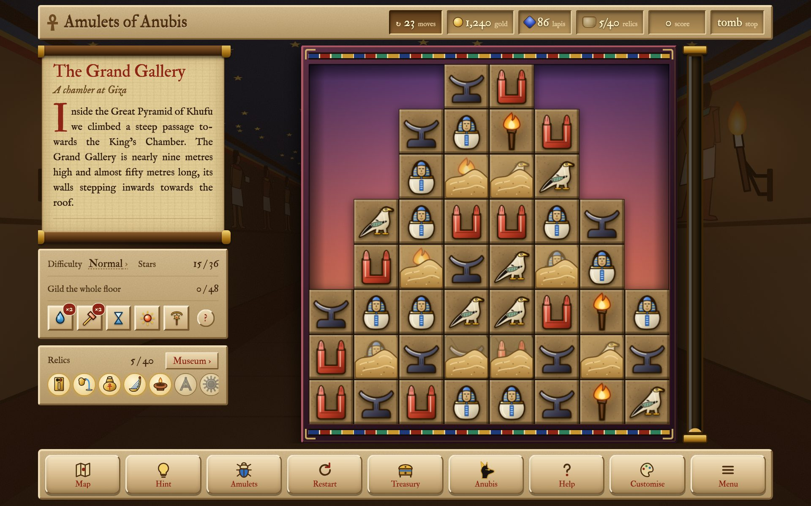

# Amulets of Anubis



Amulets of Anubis is a match-3 roguelite on the Nile. Each journey runs from
Memphis to Alexandria through twelve stops, and at each one you swap amulets
into rows of three until the grey stone floor has turned to gold. No two
journeys go the same way. The priests set different trials, a failed one
brings a curse, boons come and go, and the river throws up puzzles and choices
between the stops. What you earn is kept for the next journey, in the
Treasury's upgrades, the relics in the museum and the looks you unlock. Every
stop has its own amulets, scenery, floor plans and music, and a short note on
its history that I have tried hard to get right.

The whole game is a single HTML file. There is nothing to install and no
account to make, and it never goes online: no ads, no tracking, and no update
that changes it behind your back. Open the file in a browser and it works, and
it should still work in twenty years. It can also be installed as a web app,
and there are Android and desktop versions.

I also wanted it to be easy to change. Almost everything you see, from the
stops and their history notes to the prices in the shop and every picture,
lives in small text files that explain themselves. You can make your own
version without writing any code.

<div class="start">
<p><a href="docs/manual/part-1-making-things.md"><b>Change the game</b><br><span>The manual, part 1: your own pictures, words and prices, a new stop, tomb or boon. No programming.</span></a></p>
<p><a href="docs/content-reference.md"><b>Look something up</b><br><span>Every field of every content file, and every name the build knows.</span></a></p>
<p><a href="docs/build-guide.md"><b>Build the apps</b><br><span>The Android and desktop apps, from this one folder.</span></a></p>
<p><a href="docs/manual/part-2-the-engine.md"><b>Work on the code</b><br><span>The manual, part 2: how the engine works inside, and how to extend it.</span></a></p>
</div>

## What's in it

- **Twelve stops down the Nile**, from Memphis to Alexandria, each with its own
  floor plans, amulets and scenery. The music is composed while you play, in
  the stop's own key and on its own instrument.
- **Special amulets.** Four in a row makes a banded amulet, an L or a T makes
  a ringed one, and five in a row makes the winged sun. Some amulets also fall
  wearing a badge with a power of its own, and a few rare badges are cursed.
- **Boons, trials and shops.** Priests set you trials and reward you with
  boons, which you keep until you need them. Between stops there are puzzles
  and choices on the river. Anubis runs a stall for one-off help, and the
  Treasury sells lasting upgrades.
- **Tombs, temples and oases** open up beside nine of the stops once you have
  gilded them. The tombs are lit by torches and some of their amulets are
  buried in sand. The oases lie among date palms, with amulets under water.
- **Reasons to come back:** three seals at every stop, omens you can brave for
  a bigger reward, 46 relics for the museum, and amulet sets, floors, frames
  and sparkles to earn.
- **A gentle start.** On your first journey the game brings in its parts one
  at a time, each with a short note. If you would rather have everything at
  once, you can.
- **Four board sizes, four difficulties**, full keyboard controls, and in
  Settings dark and high-contrast colours, less motion, and fewer effects for
  older phones.

There are more pictures on the [screenshots page](docs/screenshots.md).

## Playing it

Build it once (see below), then open `dist/amulets-of-anubis.html` in a
browser. That one file is the entire game, so you can copy it anywhere and
keep it.

> **Note:** Your progress is saved in the browser you play in. To move it to
> another copy of the game, use Menu → Save and restore, which gives you a
> code you can paste in somewhere else.

## Building it

All you need is Python 3.

```sh
python3 build.py            # or double-click build.bat on Windows
```

The build checks every content file before it writes anything. If something
is wrong, it tells you which file and which line in plain words, and leaves
your last working game alone. Otherwise it writes
`dist/amulets-of-anubis.html`.

A few other commands come in handy while you work:

| Command | What it does |
|---|---|
| `python3 build.py --check` | checks the content without writing anything |
| `python3 build.py --watch` | rebuilds every time you save a file (`scripts/watch.bat` on Windows) |
| `python3 scripts/new.py` | starts a new stop, tomb, boon, relic, river event, look and so on from a ready-made file (`scripts/new.bat`) |
| `dist/try-it.html` | opens the game in try-out mode, with its own save and everything unlocked, right at the thing you changed last |

`./build.sh` builds the Android and desktop apps as well, along with the
documentation and fresh screenshots. The [build guide](docs/build-guide.md)
says what each of them needs. Everything the build makes ends up in `dist/`.

## Making it your own

Most of the game is content rather than code:

| To change | Edit |
|---|---|
| stops, tombs and temples, boons, badges, curses, omens, relics, trials, river events, shop items and looks | one small file each in `content/` |
| the words on every screen | `content/text.jsonc` |
| the numbers that tune it: rewards, difficulty, stars, when each part arrives | `content/settings.jsonc` |
| every picture: amulets, scenery, floors, badges and icons | files in `images/` (mostly SVG, see `images/README.md`) |

If you have never programmed, start with the
**[first part of the manual](docs/manual/part-1-making-things.md)**. It walks
you through changing pictures, words and numbers and adding a new stop, with
pictures at every step, and ends with how to write a boon of your own.

## Documentation

| | |
|---|---|
| [The manual](docs/manual/README.md) | in two parts: making things (for everyone) and the engine (for programmers) |
| [Content reference](docs/content-reference.md) | every field of every kind of content file |
| [Build guide](docs/build-guide.md) | the Android and desktop apps |
| [Screenshots](docs/screenshots.md) | pictures of every part of the game |

## Licence

Amulets of Anubis © 2026 Faience Games. There are three licences, one for
each kind of thing:

* **The code** (the game, the build, the tools and the scripts) is free
  software under the GNU General Public License, version 3 or (at your option)
  any later version (`GPL-3.0-or-later`): see [LICENSE](LICENSE). You may use
  it, study it, change it and share it, as long as what you share stays under
  the same licence.
* **The pictures** are in the public domain under
  [CC0 1.0](LICENSES/CC0-1.0.txt) (`CC0-1.0`), so you can use them for
  anything without asking. That is every picture in `images/` and `docs/`,
  the app icons in `web/` and `platforms/`, and the store pictures in
  `fastlane/`. What little comes from elsewhere is listed, with its source,
  in [images/CREDITS.md](images/CREDITS.md).
* **The two typefaces** in `engine/web/fonts.css`, IM Fell Double Pica and IM Fell
  English, were digitised by Igino Marini from the Fell Types and are under
  the SIL Open Font License 1.1 (`OFL-1.1`)
  ([Double Pica](LICENSES/OFL-1.1-IM-Fell-Double-Pica.txt),
  [English](LICENSES/OFL-1.1-IM-Fell-English.txt)).

## Project layout

```
build.py        builds the game into dist/ (build.bat on Windows)
build.sh        builds everything: game, apps, docs and website, all into dist/
edition.jsonc   the game's name, its file, and where its save is kept
content/        stops, relics, events, shop items, looks, text.jsonc, settings.jsonc, icons/
images/         every picture: amulets, scenery, floors, specials, badges, icons
engine/         the engine: the build, the code (src/), the page shell, stylesheet
                and fonts (web/), simulators, the smoke and edge tests (tools/)
web/            the web app's files: manifest, icons, service worker
scripts/        new.py (start new content), watch (rebuild on save)
tools/          drawing scripts, screenshots, performance tests, the old-saves test
docs/           the guides, screenshots and examples
platforms/      the Android and desktop app wrappers (sources only)
dist/           everything built: the game, apps, docs/ and website/ (not kept in git)
```
