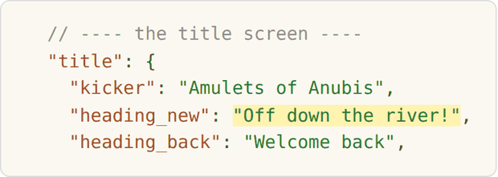
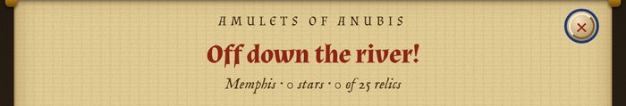

# Changing Amulets of Anubis: a guide for non-programmers

You don't need to know how to program to change this game. Most changes are
one of three kinds, and this guide walks through each:

1. **Changing pictures**: amulets, scenery, floors and icons.
   No text files at all.
2. **Changing words and numbers** in the game: a stop's name or history note,
   how many moves it gives, what things cost. You edit a small file.
3. **Adding something new**: a new stop, a new river event. You copy an
   existing file and change the copy.

After any change you **build** the game, which puts everything into one file,
and then open that file in a browser to try it.

### The quick way, in three steps

1. **Start from a ready-made file.** Double-click `scripts/new.bat` (Windows), or type
   `python3 scripts/new.py` in Terminal (Mac, Linux). It asks what you want to make (a
   stop, a tomb or temple, a relic, a river event, something for the shop, a
   new look…) and a
   short id for it, then writes a new file in the right folder with the right
   number. The file works straight away, and its comments say what every line
   does.
2. **Leave the game building itself.** Double-click `scripts/watch.bat` (or type
   `python3 build.py --watch`) and leave the window open. Every time you save
   a file, the game is built again, and if you made a slip it says so at once.
3. **Try it.** Double-click `dist/try-it.html`. It opens the game in
   **try-out mode**, right at the stop or river event you changed last, with
   every stop open, every look unlocked, a full purse and one of each boon.
   Try-out mode keeps its own save, so your real game is never touched. After
   each change, just refresh the browser.


*`scripts/new.py` asks what you want to make and writes a working file in the
right place.*


*`dist/try-it.html` opens the game straight at the stop you just changed,
with every stop, look and boon available. The red badge in the corner shows
you are in try-out mode.*

A note on what players see: on a first journey the game brings in its parts
one at a time (seals, badges, trials, the stall, river events, cursed badges,
tombs and temples, omens), each with a banner, and marks anything new with a red dot. Players
who want it all at once use Menu → *Learning pace*. Try-out mode always has
everything on, so you never have to play through to test something.

Where things live:

* **`content/`** is where every word and number in the game lives. Each small
  file is one thing: one stop, one relic, one river event. This is where you
  will be editing.
* **`images/`** holds every picture in the game (see `images/README.md`).
* **`src/`** is the code, which holds the rules of the game. You will almost
  never need to touch it.

The good news: because the content is in its own little files, changing the
game means changing text, not programming. The build even checks your files
and tells you, in plain words, what is wrong if you make a slip.

### The words the game uses

The files, and this guide, use the game's own names for things. The ones you
will meet most:

| Word | What it is |
|---|---|
| **Stop** | One place on the journey down the Nile, like Memphis or Karnak. Each has its own floor, amulets, scenery and music. |
| **Amulet** | The pieces you swap. Line up three or more of a kind to match them. |
| **Stone**, **gild** | The squares under the amulets. A match on top of a stone *gilds* it (turns it gold). Gild the whole floor to win the stop. *Thick* stone needs two matches. |
| **Special** | An amulet made by a bigger match: four in a row makes a banded one, an L or T a ringed one, five in a row the winged sun. |
| **Badge** | A small mark some amulets fall wearing, with a power used when they are matched. The rare red-ringed ones are *cursed*. |
| **Boon** | A power-up the player keeps and spends when they like: the Flood of the Nile, the Hammer of Set, and so on. |
| **Trial** | A task a priest sets at the start of a stop. Finish it for a boon; fail it and the next stop is harder (a *curse*). |
| **River event** | Something that happens between stops: a short puzzle on a small board, or a choice. |
| **Tomb**, **temple**, **oasis** (a *chamber*) | A small board beside a stop, opened once that stop is gilded: a dim tomb with amulets buried in sand, or an oasis with some under water. |
| **Seal**, **omen** | Seals are three small challenges at every stop. Omens are hardships a player may choose at a gilded stop, for a richer reward. |
| **Relic** | A lasting reward for a deed, like setting off a cascade of five. They live in the Museum. |
| **Gold**, **lapis** | The two currencies. Gold comes from gilding, lapis from specials and trials; both buy one-time help at Anubis's stall and lasting upgrades in the Treasury. |
| **Look** | Something that changes only how the game looks: amulet sets, floors, frames, sparkles, earned by playing. |

---

## What you need

- **A text editor.** Any editor that saves plain text will do:
  [VS Code](https://code.visualstudio.com) (free, every system, colours the
  text to help you spot mistakes), Notepad++ on Windows, or TextEdit on a Mac
  (choose *Format → Make Plain Text* first). Don't use Word; it adds hidden
  formatting.
- **Python 3**, which runs the build. To check whether you have it:
  - Windows: double-click `build.bat`. If a window says Python isn't found,
    install it from [python.org](https://www.python.org/downloads/) and tick
    **"Add Python to PATH"** during the install.
  - Mac or Linux: open *Terminal* and type `python3 --version`. If you see a
    version number, you're set.

## Building the game

- **Windows:** double-click `build.bat`.
- **Mac or Linux:** open Terminal, go to the game folder (type `cd `, a space,
  then drag the folder onto the Terminal window and press Enter), then type
  `python3 build.py`.

It checks every content file first. If one has a mistake, it stops and tells
you which file, which line, and what to do. It also leaves the last good game
file alone, so you can never lose a working game. When everything is fine it
prints what it added and ends with `Done`.

The game is now in `dist/amulets-of-anubis.html`. Double-click that file to
play it in your browser. That single file is the whole game: you can copy it
anywhere, share it, or keep it in an archive.

> **Keep a copy before you start.** Duplicate the whole folder first. If
> something breaks, you can always go back to the copy.

---

## 1. Your own pictures

Every picture in the game is a file in `images/`: the amulets, the scenery
behind each stop, the floors, the badges, the icons. Change one, build, and
it's in the game. `images/README.md` lists every folder, how its files are
named and how big they are.

### Try it first

Copy `docs/examples/scarab.png` into `images/amulets/`, build, and play the
first stop. Every scarab is now your picture: a `.png` or `.jpg` wins over
the `.svg` of the same name (the build mentions it). Delete `scarab.png` and
build again to get the original back.


*Memphis with `docs/examples/scarab.png` dropped into `images/amulets/`: every
scarab is now the picture.*

### Changing a picture

The pictures that come with the game are SVG files. Open one in
[Inkscape](https://inkscape.org) (free) or another drawing program, change it,
save it under the same name, and build. Or replace it with a `.png` or `.jpg`
of the same name, which is used instead of the `.svg`.

- **Amulets** (`images/amulets/`) are named after the amulet: `scarab.svg`.
  A new name adds a new amulet: `golden-falcon.svg` becomes an amulet called
  `golden-falcon` (lowercase letters, numbers and hyphens). Square, with a
  see-through background and a small margin; the picture fills its square as
  it is. Players match by colour first and shape second, so an amulet the
  same colour as another at the same stop is hard to play with.
- **Scenery** (`images/backdrops/`) and **board backings** (`images/boards/`)
  are named after the stop: `giza.svg` is behind Giza. Scenery is wide
  (1600 × 1000) and cropped to the screen, so keep the important part near
  the middle; a backing is square (800 × 800) and shows through the gaps of
  a shaped floor.
- **Floors** (`images/floors/<floor set>/`) are the squares under the
  amulets: `bare`, `thick` and `gilded-1` to `gilded-4`. Keep the three kinds
  easy to tell apart.
- **Relic pictures** (`images/relics/`), named after the relic's id, replace
  its icon.

### Icons: `images/icons/`

Every small drawing the game uses (the buttons along the bottom, the
boon, relic and menu icons, the stars, the seal, Anubis at his stall, and the
Nile map) is an SVG file in `images/icons/`, in folders:

| Folder | What's in it | Size |
|---|---|---|
| `dock/` | the buttons along the bottom: map, hint, amulets, restart, treasury, stall, help, customise, menu | 32 × 32 |
| `boons/` | one per boon (flood, hammer, …) | 24 × 24 |
| `relics/` | one per relic drawing | 32 × 32 |
| `menu/` | the menu and title-screen icons | 32 × 32 |
| `ui/` | the title ankh, stars, the seal, Anubis at the stall | as noted in each file |
| `map/` | the Nile map, and the markers for its stops | 360 × 560 |

Icons must stay SVG. Keep the `viewBox` at the top of the file the same size,
and give any gradient inside it an id no other icon uses. A new relic can have
its own: draw `images/icons/relics/<relic id>.svg` and it is used
automatically.

**Keep pictures small.** Every picture goes inside the game file. A few large
photographs can make it several megabytes, which still works but loads more
slowly on phones. The build warns you about anything over 2 MB.

---

## 2. Changing words and numbers

These are in the `content/` folder. Open the file in your editor, find the
line (your editor's *Find*, usually Ctrl+F or ⌘F, is the quickest way), change
it, save, and build.

**The one rule to remember for every content file:** the text and the numbers
live inside `{ ... }` marks.

- **Text** goes between two double quotes: `"Giza"`.
- **Numbers** go with no quotes: `20`.
- **Yes or no** is `true` or `false`, with no quotes.
- **Lists** go between square brackets: `["ankh", "scarab"]`.
- **A field name** goes before a colon: `"moves": 20`.

You can leave `//` comments in a file (the ones already there explain each
field), and you can leave a comma after the last item. Just don't delete a
bracket, a quote, or the colon.

### The words on the screens: `content/text.json`

Every word the game's own screens show (the title screen, the menu, the
buttons, the shops, Customise, the map, trials, river events, the victory and
failure screens, the banners, the words that float up on the board, How to
play, the names of board sizes) lives in **one file**, `content/text.json`,
grouped by screen. (Boons, badges, curses and omens are the exception: each
has its own file in `content/boons/`, `content/badges/`, `content/curses/` or
`content/omens/`, with its words in it.)

```json
"win": {
  "title": "{stop} is gilded",
  "lede": "The floor gleams like the sun at noon.",
```

Change the text **on the right**; leave the key **on the left** alone. A few
things are special:

- `{stop}`, `{n}` and other words in curly brackets are filled in by the game
  (the stop's name, a number). Keep them; you may move them.
- `{n|stone|stones}` means "stone" when the number is 1, "stones" otherwise.
- `**bold**` and `*italic*` work, and `\n` starts a new line.

If you misspell a key, the build says which one and suggests the right spelling.





*Change one line in `content/text.json`, build, and the title screen says it.*
(Names and texts of stops, relics, trials, river events, shop items and looks
stay in their own files, described below.)

### A stop's name, subtitle or history note

There is one file per stop in `content/stops/`. Each looks like this:

```json
{
  "id": "giza",
  "name": "Giza",
  "subtitle": "The house of Khufu",
  "history": "Khufu's Great Pyramid once stood about 146 metres tall ...",
  "moves": 20,
```

Change the text **between the double quotes**. Leave `id` alone once people
have played, because saves remember stops by it.

> **Apostrophes are fine here.** In these content files you can type a normal
> apostrophe in text, like *Khufu's*. Just don't put a double quote inside the
> text.

### How many moves a stop gives

Same place: change `"moves": 20` to another number. More is easier. The
difficulty slider and board size scale from this number, so change it a little
at a time: two or three moves makes a real difference.

### The numbers that tune the game: `content/settings.json`

One file holds the whole-game numbers, each with a comment saying what it does.
Among them:

- **`stops_open_at_start`**: how many stops are open from the start (`12`
  opens the whole river).
- **`staging`**: at which stop each part of the game arrives on a first
  journey (seals, badges, trials, the stall, river events, cursed badges,
  tombs and temples, omens), and whether new players start with *one at a time* or *everything
  now*.
- **`stars`**: how many moves must be left over for two and three stars.
- **`difficulty`**: for Relaxed, Normal, Hard and Pharaoh, the moves, how often
  badges fall, and how soon hints appear.
- **`river_event_percent`**, **`trial_offer_percent`**: how often river events
  and trials come up (`30` means 30% of the time).
- **`badges`**: how many good badges may be on the board at once. How often
  each badge turns up is its `"weight"`, in its own file in `content/badges/`
  (`0` switches one off, cursed ones included).
- **`omens`**, **`seals`**, **`earnings`**, **`persistence`**: rewards, and how
  kind the game is after a failure.

### Prices

One file per thing, in two places:

- **Anubis's stall** (bought for one stop): `content/anubis-stall/`, the
  `"price"` number.
- **The treasury** (lasting upgrades): `content/treasury/`, the `prices` list,
  with one price per level, like `[300, 600, 1200]`.

---

## 3. Adding something new

The easiest start is `scripts/new.bat` / `python3 scripts/new.py` (see *The quick way* above):
it makes a working file for you to change. You can also do it by hand: **copy
the nearest existing file, give the copy a new number and a new id, change
what you need, build.** Either way, the build checks the file and tells you if
something is off.

`python3 scripts/new.py` can make: `stop`, `relic`, `event-puzzle`, `event-choice`,
`trial`, `stall` (Anubis's stall), `upgrade` (the Treasury), `floor-shape`,
`amulet`, `amulet-set`, `floor-set`, `frame` and `sparkle`. Give both at once
to skip the questions: `python3 scripts/new.py relic golden-ankh`.

### A new stop

A stop is one file in `content/stops/`. Copy the last one (Alexandria,
`12-alexandria.json`) to a new file numbered after it: `13-<name>.json`.

Change, at least:

- `"id"`: a short lowercase name, like `"koptos"`.
- `"name"`, `"subtitle"`, `"history"`.
- `"moves"`: start with the same number as the stop you copied.
- `"amulets"`: four to six amulet names. You can use any built-in amulet
  (the list is in `content/amulets/`) or a new amulet you added as a picture.
- `"map_position"`: where the stop sits on the Nile map. `y` runs from about
  45 (the coast, top) to 506 (Abu Simbel, bottom); `label` is `"right"` or
  `"left"`.

The `floor_plan` is eight lines of eight characters: `.` is a gap, `0` is
already gold, `1` is bare stone, and `2` is thick stone that needs two
matches. Every stone must have room for three in a row through it. The build
checks this and tells you which square is stuck if one can't be cleared.

A stop needs two pictures, named after its id: `images/backdrops/<id>.svg`
behind everything, and `images/boards/<id>.svg` through the gaps in the
floor. `scripts/new.py` copies Saqqara's for a new stop, so it works straight
away; draw over them when you like. To share another stop's picture instead,
name it in the stop's file: `"scenery": "giza"`.

Each stop also has three `"seals"`: small challenges stamped the first time a
win there meets them, like `{"text": "Win without spending a boon", "when":
{"win_without_boons": true}}`. The conditions you can use are listed in
`docs/content-reference.md`.

Then build and play it (`dist/try-it.html` opens straight at your new stop).
To tune the difficulty, change `"moves"` and rebuild. For a fairer test than
your own hands, `node tools/sim.js 1 classic 8 13 24` plays every stop with a
simple bot and prints how often it wins; aim for about 65–75% on Normal.

### A new river event

Copy one of the puzzle events in `content/river-events/` to a new numbered file
and change its `"id"`, `"title"`, `"text"`, `"moves"`, and `"reward"`. The
file explains its own fields in the comment at the top.

### A new tomb, temple or oasis

Copy one of the files in `content/chambers/` (or run `new chamber my-tomb`) and change its
`"id"`, `"at"` (the stop it is beside), `"name"`, `"text"`, `"moves"`,
`"floor_plan"` and `"reward"`. In the floor plan, `s` is a stone with an
amulet buried in sand on it. For an oasis, write `"setting": "oasis"` and use
`w` (an amulet under water) instead. `"scenery"` picks the picture behind the
board (`"tomb"`, `"sanctuary"` or `"oasis"`, or your own in
`images/backdrops/`), and `"amulets"` its own amulets. A stop can have one. Build, then
double-click `dist/try-it.html` to go straight into it.

### A new relic

Copy one of the files in `content/relics/` and change the `"id"`, `"name"`,
`"description"` and the `"found_when"` block, which says what the player must do
to find it (for example `{"stops_won": 10}`). The build lists every condition name it knows if you
misspell one.

### A new boon, badge, curse or omen

These four are each a file too, and each picks what it does from a short
list the game already knows, written in the file's own comments.

* **A boon** (`content/boons/`, or `new boon my-boon`): a power the player
  holds. Give it a `"name"`, a `"short"` name for its button, a
  `"description"`, and an `"effect"` such as `"extra_moves"` with an
  `"amount"`. Then give it out: as a trial's prize, in Anubis's stall, or as
  a river event's reward.
* **A badge** (`content/badges/`, or `new badge my-badge`): a mark an
  amulet can fall wearing. Give it a `"name"`, how it `"looks"`, an
  `"effect"` such as `"gild_stones"`, a `"weight"` (how often it turns up)
  and a glow `"colour"`, and draw its picture in `images/badges/`.
* **A curse** (`content/curses/`, or `new curse my-curse`): what failing a
  trial costs at the next stop. Pick an `"effect"` such as `"thick_stones"`
  and give its `"strength"` on each difficulty (keep Relaxed at 0).
* **An omen** (`content/omens/`, or `new omen my-omen`): a hardship a player
  may brave at a gilded stop, for a richer reward. It picks from the same
  list as the curses, with one `"amount"`.

Write `{n}` in the words where the number goes: `"{n} fewer moves"`.

---

## If something goes wrong

**The build stops and says a file has a problem.** Read the line it prints:
it names the file, the line number, the offending text, and what to do. Fix
that one thing, build again, and repeat.


*Here a stop's `"moves"` was written as `"lots"`. Nothing is built until it is
fixed, and the game you had before still works.*

The most common slips, in order:

1. A missing comma between two lines, or a missing quote mark.
2. A field name that the build doesn't know. It will suggest the closest
   match if there is one.
3. A bracket or quote deleted by accident when copying a file.

**Try-out mode shows something odd, or you want a fresh start there.** Its save
is separate from your real one; in try-out mode, *Complete reset* on the title screen clears
only the try-out save.

**The game shows an empty board or a blank page** even though the build said
`Done`. Open the game, press **F12** (on a Mac, ⌥⌘I) to open the browser's
developer tools, and click the **Console** tab. A red message names the
problem and, usually, the line.

When in doubt, go back to your copy of the folder, and make the change again
more slowly. Change one thing, build, check, then change the next.

## Putting your version on Android

The Android app is built from the same `dist` file with Google's Android
tools; `platforms/android/BUILD.md` has the steps. If that's more than you want to take
on, the installable web app route in `docs/developer-guide.md` works with just a
free website host, and gives you a home-screen app too.
