# Part 1: Making things

*The manual of Amulets of Anubis, for everyone who wants to change the game.
No programming needed until the last chapter, and even there only a little.*

This part is for anyone who wants to make the game their own: new stops,
new pictures, different words, a harder river or a kinder one. Nearly all of
it is done by editing small text files, and the game checks your work every
time you build it. You can't break it for good: if something is wrong, the
build says what and where, and your last working game stays as it was.

[Part 2](part-2-the-engine.md) is for programmers and explains how the game
works inside. The [content reference](../content-reference.md) lists every
field of every kind of file, for when you need the exact name of something.

**Contents**

1. [Getting ready](#1-getting-ready)
2. [The quick way](#2-the-quick-way)
3. [How the game is put together](#3-how-the-game-is-put-together)
4. [The words the game uses](#4-the-words-the-game-uses)
5. [Pictures](#5-pictures)
6. [Words and numbers](#6-words-and-numbers)
7. [Adding something new](#7-adding-something-new)
8. [Is it fair? Checking the balance](#8-is-it-fair-checking-the-balance)
9. [When the list isn't enough: a little code](#9-when-the-list-isnt-enough-a-little-code)
10. [If something goes wrong](#10-if-something-goes-wrong)
11. [Sharing your version](#11-sharing-your-version)

---

## 1. Getting ready

You need two things.

- **A text editor.** Any editor that saves plain text will do.
  [VS Code](https://code.visualstudio.com) is free on every system and
  colours the text, which helps you spot a missing quote. Notepad++ on
  Windows and TextEdit on a Mac work too (in TextEdit, choose *Format → Make
  Plain Text* first). Don't use Word: it adds hidden formatting.
- **Python 3**, which runs the build.
  - On Windows, double-click `build.bat`. If a window says Python isn't
    found, install it from [python.org](https://www.python.org/downloads/)
    and tick **Add Python to PATH** during the install.
  - On a Mac or Linux, open Terminal and type `python3 --version`. If you
    see a version number, you're ready.

**Building** turns all the small files into the game.

- **Windows:** double-click `build.bat`.
- **Mac or Linux:** open Terminal, type `cd ` (with a space), drag the game
  folder onto the window, press Enter, then type `python3 build.py`.

The build checks every file first. When everything is fine it ends with
`Done`, and the game is in `dist/amulets-of-anubis.html`. Double-click it to
play. That one file is the whole game: you can copy it anywhere, send it to a
friend, or keep it for twenty years.

> **Keep a copy before you start.** Duplicate the whole folder. If you get
> lost, you can always go back to the copy.

## 2. The quick way

Three habits make changing the game quick and safe.

1. **Start from a ready-made file.** Double-click `scripts/new.bat`, or type
   `python3 scripts/new.py`. It asks what you want to make and a short name
   for it, then writes a working file in the right folder, with a comment on
   every line saying what it does.
2. **Let the game build itself.** Double-click `scripts/watch.bat`, or type
   `python3 build.py --watch`, and leave the window open. Every time you save
   a file, the game is built again, and a slip is reported at once.
3. **Try it in try-out mode.** Double-click `dist/try-it.html`. The game
   opens straight at the thing you changed last, with every stop open, every
   look unlocked, a full purse and one of each boon. Try-out mode has its own
   save, so your real game is never touched. After each change, refresh.

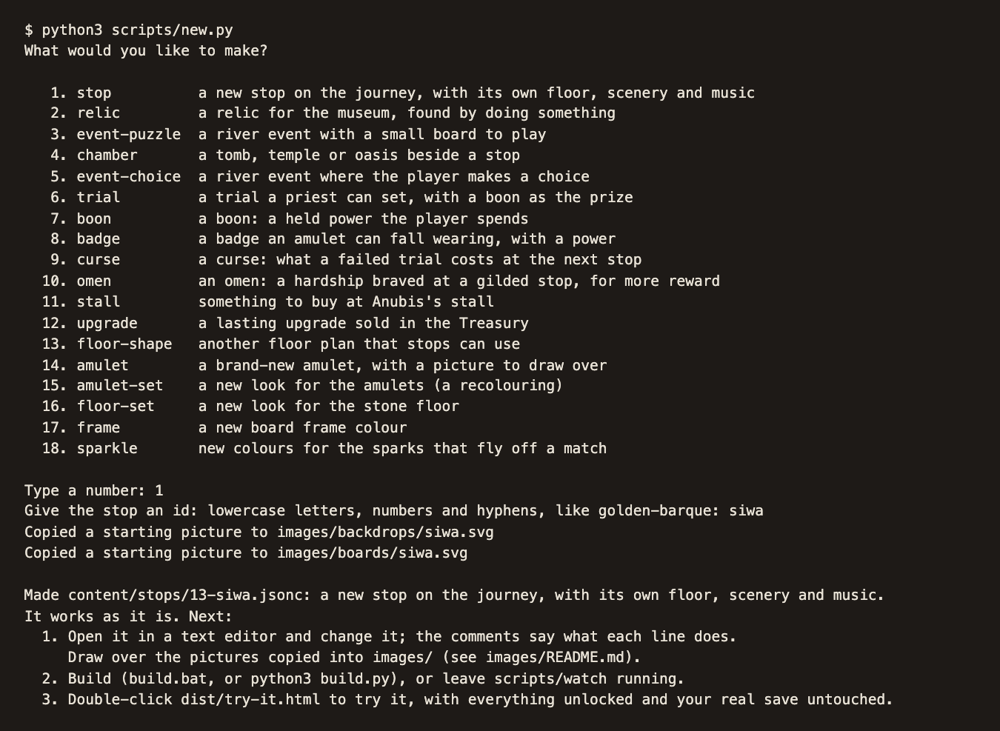

*`scripts/new.py` asks what you want to make and writes a file that works
straight away.*

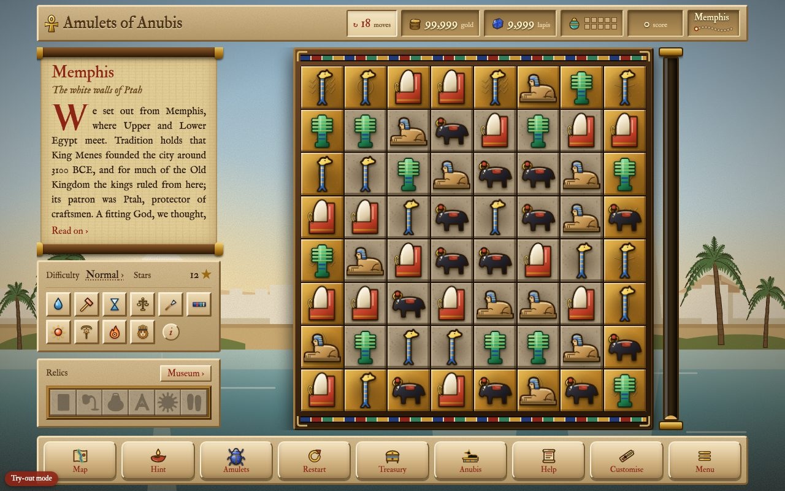

*Try-out mode opens at the stop you just made. The red badge in the corner
reminds you that this isn't your real save.*

`scripts/new.py` can make these, and you can name both at once to skip the
questions (`python3 scripts/new.py relic golden-ankh`):

| Name | What it makes |
|---|---|
| `stop` | a new stop on the journey, with its own floor, scenery and music |
| `chamber` | a tomb, temple or oasis beside a stop |
| `event-puzzle`, `event-choice` | a river event: a small board to play, or a choice |
| `trial` | a task a priest can set, with a boon as the prize |
| `boon`, `badge`, `curse`, `omen` | the powers and hardships of the game |
| `relic` | a relic for the Museum, found by doing something |
| `stall`, `upgrade` | something for Anubis's stall, or a lasting upgrade in the Treasury |
| `amulet` | a brand-new amulet, with a picture to draw over |
| `floor-shape` | another floor plan that stops can use |
| `amulet-set`, `floor-set`, `frame`, `sparkle` | new looks, earned by playing |

## 3. How the game is put together

It helps to know the three parts of the folder, and what the build does
with them.

- **`content/`** is everything a player sees or reads that isn't a rule: the
  stops and their history notes, the relics, the river events, the shop, the
  looks, and every word on every screen. One small file per thing. This is
  where you will do almost all your work.
- **`images/`** holds every picture: amulets, scenery, floors, badges and
  icons. `images/README.md` lists every folder and how its files are named.
- **`src/`** is the code: the rules of the game, and the drawing, sound and
  screens. You only need it for chapter 9.

The **build** (`build.py`) reads every content file, checks it, checks that
everything it mentions exists (a stop's amulets, a relic's condition, a
shop item's boon), and then pours it all into the code, together with the
pictures, to make the one game file. If anything is wrong, it writes
nothing and tells you the file, the line and what to do.

So the code never needs to know that your new stop exists. A stop's scenery,
its place on the map, its music and its entry in How to play all come from
its file and its pictures.

One more thing about how players meet what you make: on a first journey the
game brings in its parts one at a time (seals, badges, trials, the stall,
river events, cursed badges, tombs and oases, omens), each with a banner. A
new boon or omen of yours appears once its part of the game has arrived.
Try-out mode always has everything on.

In short, a build goes like this:

| Step | What happens |
|---|---|
| 1. Read | every file in `content/` and `images/` |
| 2. Check | every field, every name, every floor plan: can each stone be cleared? |
| 3. Connect | every mention of another thing must find it (a stop's amulets, a trial's boon) |
| 4. Pour in | the checked content and the pictures go into the code |
| 5. Write | one file, `dist/amulets-of-anubis.html`, and `dist/try-it.html` |

If step 2 or 3 finds a problem, step 5 never happens.

> **In the engine:** [Part 2, chapter 2, *The build*](part-2-the-engine.md#2-the-build)
> describes each step in detail.

## 4. The words the game uses

The files, and this manual, use the game's own names for things.

| Word | What it is |
|---|---|
| **Stop** | One place on the journey down the Nile, like Memphis or Karnak, with its own floor, amulets, scenery and music. |
| **Amulet** | The pieces you swap. Three or more of a kind in a row match. |
| **Stone**, **gild** | The squares under the amulets. A match on a stone *gilds* it. Gild the whole floor to win the stop. *Thick* stone needs two matches. |
| **Special** | An amulet made by a bigger match: four in a row makes a banded one, an L or T a ringed one, five in a row the winged sun. |
| **Badge** | A mark some amulets fall wearing, with a power used when they're matched. Red-ringed ones are *cursed*. |
| **Boon** | A power the player keeps and spends when they like, such as the Flood of the Nile. |
| **Trial** | A task a priest sets at the start of a stop. Finish it for a boon; fail it, and the next stop is *cursed*. |
| **River event** | Something between two stops: a short puzzle on a small board, or a choice. |
| **Chamber** | A tomb, temple or oasis beside a stop, opened once the stop is gilded. Tombs have amulets buried in sand, oases amulets under water. |
| **Seal**, **omen** | Seals are three small challenges at every stop. Omens are hardships a player may brave at a gilded stop, for a richer reward. |
| **Relic** | A lasting reward for a deed, kept in the Museum. |
| **Gold**, **lapis** | The two currencies. They buy one-time help at Anubis's stall and lasting upgrades in the Treasury. |
| **Look** | Something that changes only how the game looks: amulet sets, floors, frames, sparkles. |

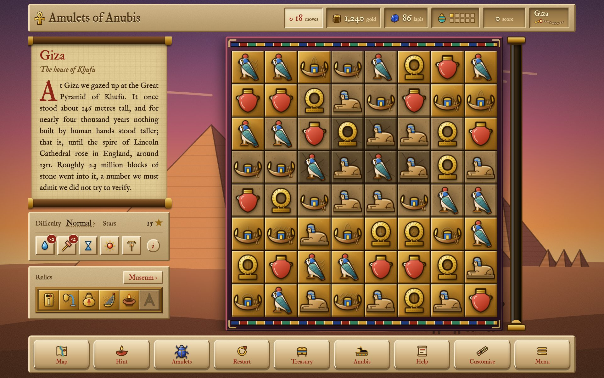

*Giza in play. Beside the board: the stop's history note, the difficulty and
the boons held, and the relics found. On the board, some stones are already
gilded; the tube on the right fills with gold sand as the floor is gilded.*

## 5. Pictures

Every picture is a file in `images/`. Change one, build, and it's in the
game.

### Try it first

Copy `docs/examples/scarab.png` into `images/amulets/`, build, and play the
first stop. Every scarab is now that picture: a `.png` or `.jpg` wins over
the `.svg` of the same name, and the build says so. Delete it and build
again to get the original back.

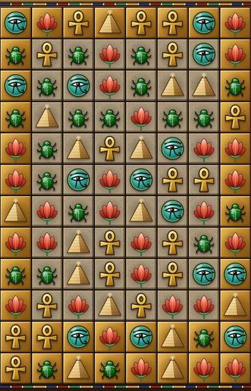

### What's where

The pictures that come with the game are SVG drawings. Open one in
[Inkscape](https://inkscape.org) (free), change it, and save it under the
same name. Or drop in a `.png` or `.jpg` with the same name instead.

- **Amulets** (`images/amulets/`) are named after the amulet: `scarab.svg`.
  A new name is a new amulet: `golden-falcon.svg` becomes an amulet called
  `golden-falcon`. Square, with a see-through background and a small margin.
  Players tell amulets apart by colour first and shape second, so two
  amulets of the same colour at one stop are hard to play.
- **Scenery** (`images/backdrops/`) is named after its stop: `giza.svg` is
  behind Giza, and also behind the title screen while you're there. It's
  wide (1600 × 1000) and cropped to the screen, so keep what matters near
  the middle.
- **Board backings** (`images/boards/`) show through the gaps of a shaped
  floor: square, 800 × 800, named after the stop.
- **Floors** (`images/floors/<floor set>/`) are the squares under the
  amulets: `bare`, `thick`, and `gilded-1` to `gilded-4`. Keep the three
  kinds easy to tell apart.
- **Relic pictures** (`images/relics/<relic id>.png`) replace a relic's
  icon.

### Icons

The small drawings the game uses are SVG files in `images/icons/`, in
folders:

| Folder | What's in it |
|---|---|
| `dock/` | the buttons along the bottom |
| `boons/` | one per boon |
| `relics/` | one per relic |
| `menu/` | the tiles of the Menu and the title screen |
| `codex/` | one per chapter of How to play, named after the chapter |
| `stall/` | the things Anubis sells that aren't boons (a stall file names one with `"icon"`) |
| `ui/` | the ankh, stars, the seal, the barque, the doorways |
| `map/` | the Nile map and its markers |

Icons must stay SVG. Keep the `viewBox` at the top of the file as it is, and
give any gradient inside a name no other icon uses.

### In another drawing program

The SVGs open in Inkscape, Affinity, Illustrator and Figma as shapes you can
change. For other programs, `python3 tools/art-export.py` makes
`dist/art-export/` with every picture as a vector PDF, the small ones as
pixel art at 32 and 64 pixels, as Aseprite files, and as sprite sheets for
game engines. (The build also makes a large PNG of every picture, in
`dist/art-references/`.)

When you save an icon back from a drawing program, check two things, and
the build checks them too:

- **It's a clean SVG**: in Affinity or Illustrator, export as SVG with the
  text as shapes. A picture that isn't well-formed stops the build.
- **Its gradients have names of their own.** Drawing programs call them
  `_Linear1`, `_Linear2` and so on in every file, and icons share one page,
  so the second icon would take the first one's colours. The build names
  the clash; rename the gradient (and the `url(#...)` that uses it).

Some pictures are drawn by a script: the scenery (`tools/scenery/`) and
many amulets (`tools/amulets/draw.py`). If you edit one of those by hand,
don't run its script again, or it draws the old picture back.

**Keep pictures small.** Everything goes inside the one game file, and big
photographs make it slow to load on a phone. The build warns about anything
over 2 MB.

## 6. Words and numbers

### How a content file is written

Every content file is one block between `{` and `}`. Inside it:

- **Text** goes between double quotes: `"Giza"`.
- **Numbers** have no quotes: `20`.
- **Yes or no** is `true` or `false`, without quotes.
- **Lists** go between square brackets: `["ankh", "scarab"]`.
- **The name of a field** comes before a colon: `"moves": 20`.

Lines starting with `//` are comments, for people; the game ignores them.
A comma after the last item is fine. Just don't delete a bracket, a quote or
a colon. Apostrophes are fine in text (*Khufu's*); a double quote inside
text is not.

### Every word on the screens: `content/text.jsonc`

Every word the game's own screens show lives in one file,
`content/text.jsonc`, grouped by screen: the title screen, the Menu, the
buttons, the shops, the scrolls for winning and losing, How to play, the
banners.

```json
"win": {
	"title": "{stop} is gilded",
	"lede": "The floor gleamed like the sun at noon.",
```

Change the text on the **right**; leave the name on the left alone.

- Words in curly brackets, like `{stop}` or `{n}`, are filled in by the game.
  Keep them; you may move them.
- `{n|stone|stones}` says "stone" when the number is 1 and "stones"
  otherwise.
- `**bold**` and `*italic*` work, and `\n` starts a new line.

If you mistype a name, the build says which one and suggests the right one.

The names and texts of stops, relics, trials, river events, shop items,
boons, badges, curses, omens and looks are in their own files, below.

### A stop's name, subtitle and history note

One file per stop, in `content/stops/`:

```json
{
	"id": "giza",
	"name": "Giza",
	"subtitle": "The house of Khufu",
	"history": "At Giza we stood beneath the Great Pyramid of Khufu ...",
	"moves": 20,
```

Change the text between the quotes. Leave `id` alone once people have
played: saves remember stops by it. The history note is written as a
travel journal ("we came to Karnak at noon"), and its facts should be true:
prefer the plainly documented fact to the colourful legend. If a note is
too long to fit beside the board, the game shows the first lines and a
"Read on" button, so length is never a problem, but two or three sentences
read best.

### How many moves a stop gives

In the same file: `"moves": 20`. More is easier. The difficulty and the
board size scale from this number, so change it a little at a time; two or
three moves make a real difference.

### The numbers that tune the game: `content/settings.jsonc`

One file holds the whole-game numbers, each with a comment. Among them:

- `stops_open_at_start`: how many stops are open from the beginning.
- `staging`: at which stop each part of the game arrives on a first
  journey, and whether new players get them one at a time.
- `stars`: how many moves must be left for two and three stars.
- `difficulty`: for Relaxed, Normal, Hard and Pharaoh, the moves, how often
  badges fall and how soon hints appear.
- `river_event_percent`, `trial_offer_percent`: how often river events and
  trials come up.
- `earnings`, `omens`, `seals`, `persistence`: rewards, and how kind the
  game is after a failed try.

**An example: a gentler game for young players.** In `settings.jsonc`, open
every stop at once and bring in the game's parts all together:

```jsonc
	"stops_open_at_start": 12,
	"staging": {
		"learning_pace": "everything now",
```

and in the `difficulty` block, give Normal a few more moves. Build, and a
new player can go anywhere from the start. Nothing else changes.

> **In the engine:** the numbers are read by `settings()` in `build.py`
> and reach the code as `CONTENT.settings`; [Part 2, chapter 11](part-2-the-engine.md#11-balance-and-the-simulators)
> says which numbers tune what.

### Prices

- **Anubis's stall** (help for one stop): `content/anubis-stall/`, the
  `"price"`.
- **The Treasury** (lasting upgrades): `content/treasury/`, the `"prices"`
  list, one price per level, like `[300, 600, 1200]`.

## 7. Adding something new

The easiest start is `scripts/new.py` (chapter 2). By hand works too: copy
the nearest existing file, give the copy the next number and a new `id`,
change what you need, and build. **The number at the front of a file name
is its place in the order**: `13-koptos.jsonc` comes after `12-alexandria.jsonc`.

### A new stop

`python3 scripts/new.py stop koptos` writes `content/stops/13-koptos.jsonc`
and copies Saqqara's pictures for it, so it works at once. Then change:

- `name`, `subtitle`, `history`, and `moves`.
- `amulets`: four to six amulet names, from `content/amulets/` or pictures
  you added. Keep them different in colour **and** shape.
- `floor_plan`: eight lines of eight characters. `.` is a gap, `0` is
  already gold, `1` is bare stone, `2` is thick stone. Every stone needs
  room for three in a row through it; the build names any square that
  could never be cleared.
- `map_position`: where the stop sits on the Nile map, from about `y` 45 at
  the coast to 506 at Abu Simbel, with its `label` on the `"left"` or
  `"right"`.
- `music`: a key, a scale and an instrument (`harp`, `lyre`, `oud`, `flute`
  or `bell`). The music is composed as you play, in that key.
- `seals`: three small challenges, like
  `{"text": "Win without spending a boon", "when": {"win_without_boons": true}}`.
  The conditions are listed in the content reference.

Draw over `images/backdrops/koptos.svg` and `images/boards/koptos.svg`
when you like, or share another stop's with `"scenery": "giza"`.

**An example: a floor in the shape of a ring.** Here `.` is a gap, `1`
bare stone and `2` thick stone:

```jsonc
	"floor_plan": [
		"..1111..",
		".122221.",
		"11....11",
		"12....21",
		"12....21",
		"11....11",
		".122221.",
		"..1111.."
	],
```

Every stone has two neighbours in a line, across or down, so each can be
cleared. If one couldn't, the build would say so: "the square at row 3,
column 1 can never be matched".

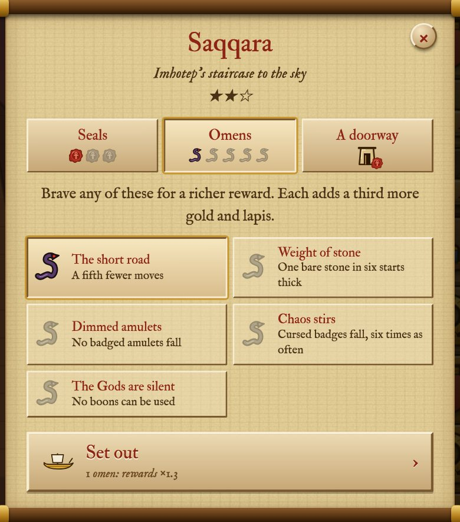

*A stop's card on the map, once the stop is gilded. Its three seals come
from the stop's file; the omens and the doorway from their own files.*

### A new amulet

`python3 scripts/new.py amulet golden-falcon` writes
`content/amulets/NN-golden-falcon.jsonc` (its name, plural and what the
symbol meant, shown in How to play) and a picture to draw over in
`images/amulets/`. Then add `golden-falcon` to a stop's `amulets`.

### A new river event

A **puzzle** (`new.py event-puzzle`) is a small board with a goal: gild
the floor, collect so many of one amulet, or reach a score. A **choice**
(`new.py event-choice`) offers two or three things to do, each with a cost
or a gift. It's kind to offer one that simply walks on.

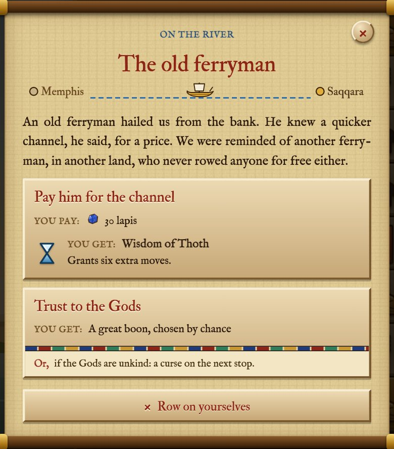

### A new tomb, temple or oasis

`python3 scripts/new.py chamber my-tomb`, then set `at` (the stop it's
beside), its `name`, `text`, `moves`, `floor_plan` and `reward`. In the
floor plan, `s` is a stone with an amulet buried in sand. For an oasis,
write `"setting": "oasis"` and use `w` for an amulet under water. A stop
can have one chamber.

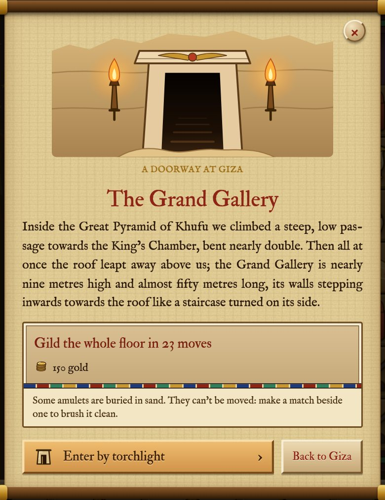

*A tomb's doorway. The picture, the note and the task all come from the
chamber's file.*

### A new relic

`new.py relic`, then its `name`, `description` and `found_when`: what the
player must do, like `{"stops_won": 10}` or `{"best_cascade": 5}`. Every
condition you list must be met. Its picture is
`images/icons/relics/<id>.svg`, or another icon named in `"icon"`.

**An example: a relic for the brave**, found by winning twenty stops on Hard
(or Pharaoh) and holding 500 lapis at once. Every condition must be met, and
they count across all the player's journeys:

```jsonc
	"id": "sphinx-seal",
	"name": "Seal of the sphinx",
	"description": "Win twenty stops on Hard, and hold 500 lapis at once.",
	"found_when": {"hard_wins": 20, "lapis_held": 500},
	"reward": {"lapis": 25}
```

The [content reference](../content-reference.md) lists every condition.

### A new trial

`new.py trial`: a `goal` (clear so many amulets, make specials, a cascade,
win with moves to spare and so on), a `target`, the words, and the `boon`
it gives.

### A new boon, badge, curse or omen

Each is a file, and each picks what it **does** from a list the game
already knows. The list is written in the comments of every such file.

- **A boon** (`content/boons/`) is a power the player holds and spends: a
  `name`, a `short` name for its button (about eight letters), a
  `description`, and an `effect` such as `"extra_moves"` with an `amount`.
  Give it out as a trial's prize, in Anubis's stall, or as a river event's
  reward. Its picture is `images/icons/boons/<id>.svg`.
- **A badge** (`content/badges/`) is a mark an amulet can fall wearing: a
  `name`, how it `looks` (a few words, so players can tell badges apart),
  an `effect` such as `"gild_stones"`, a `weight` (how often it turns up,
  against the others) and a glow `colour`. Draw it in `images/badges/`.
- **A curse** (`content/curses/`) is what a failed trial costs at the next
  stop: an `effect` such as `"thick_stones"` and its `strength` on each
  difficulty. Keep Relaxed at 0.
- **An omen** (`content/omens/`) is a hardship a player may brave for a
  richer reward. It picks from the same list as the curses, with one
  `amount`.

Write `{n}` in the words where the number goes: `"{n} fewer moves"`. If
the effect you want isn't in the list, chapter 9 shows how to add one.

Every boon, badge, curse and omen appears in How to play by itself, with its
picture and words:

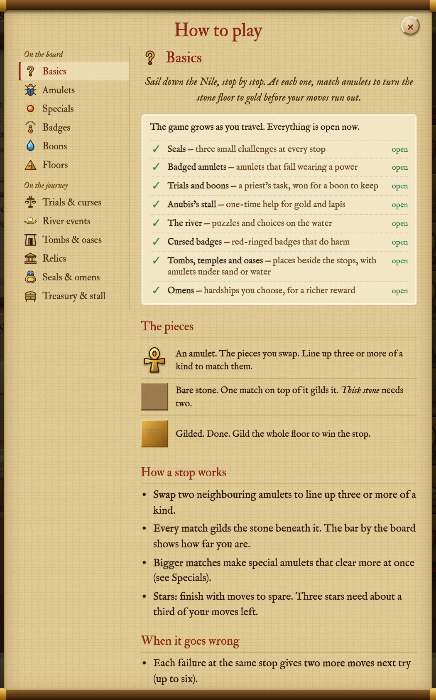

### Something for the shops

- **Anubis's stall** (`new.py stall`): an item gives more moves now, a
  reshuffle, a Second wind, or a boon.
- **The Treasury** (`new.py upgrade`): a lasting upgrade, with one price
  per level and an `effect` such as `extra_moves` or `win_gold`.

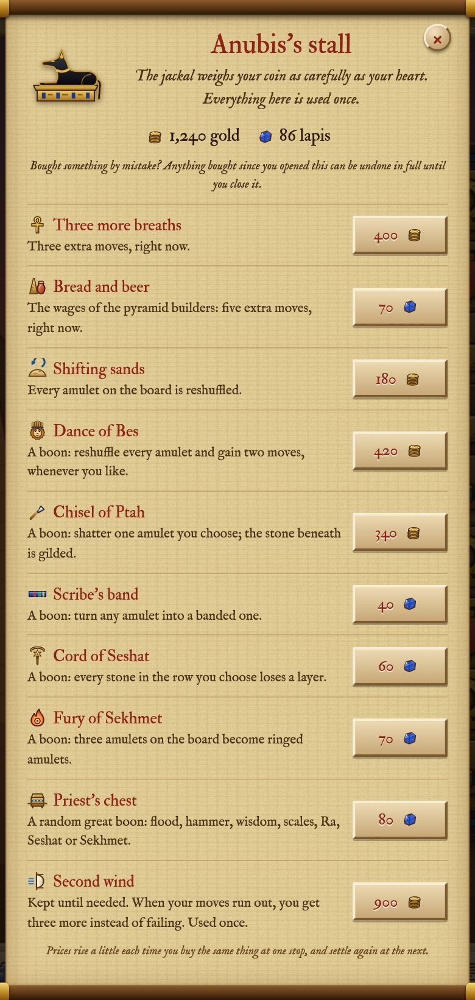

### New looks

Looks change nothing but how the game looks, and are earned by playing.
Each has `unlocked_by`: the conditions that open it, like `{"stars": 20}`.

- **An amulet set** (`new.py amulet-set`) recolours the existing amulets
  with `colour_changes`: `hue_shift`, `saturation`, `brightness` and so on.
  Shift colours rather than take them away, or every amulet looks alike.
- **A floor set** (`new.py floor-set`) is a folder of floor pictures.
  Check it against every stop's amulets: a blue floor hides a blue scarab.
- **A frame** or **a sparkle** is just colours.

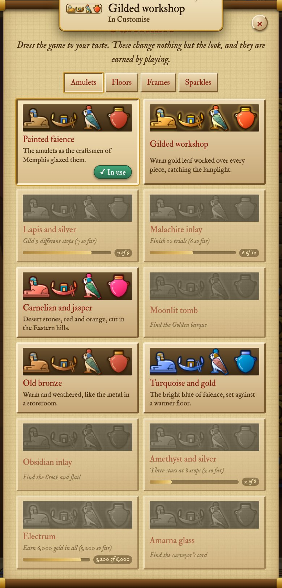

*Customise shows every look. A locked one says what opens it, and how far
along the player is.*

### A new floor shape

`new.py floor-shape`: a floor plan that several stops can share, with a
`move_multiplier` giving harder shapes a few more moves. List its `id` in a
stop's `shared_floor_shapes`.

## 8. Is it fair? Checking the balance

Your own hands are a poor judge of difficulty: you know your stop too well.
The game comes with a small robot player that plays a stop many times and
counts its wins. It needs [Node.js](https://nodejs.org) (free).

```sh
node tools/journey-sim.js 1 60
```

This plays sixty first journeys on Normal, the way a new player meets them,
and prints each stop's win rate. Aim for about **65 to 75 per cent** on
Normal, with early stops a little higher than late ones. The robot never
plans ahead, so people do a little better. If your stop is far off, change
its `moves` by one or two and run it again.

For a river event puzzle, `node tools/events-sim.js` does the same: aim for
between half and nine in ten.

## 9. When the list isn't enough: a little code

Everything so far picks from lists the game already knows: a boon's
`effect`, a badge's `effect`, a curse's `effect`. When you want something
none of them does, you add a new entry to one of those lists. That is a few
lines of JavaScript, the language the game is written in. You don't need to
know it well: most new entries start as a copy of one that does something
close, and this chapter explains every line you will meet.

### Five ideas are enough

Code can look dense, but the entries in these lists use only five ideas.

1. **Names for things.** `core.movesLeft` is the number of moves left.
   `const c0 = sq % COLS;` makes a new name, `c0`, for a number worked out once
   and used below. `let n = 0;` is the same, for a number that will change.
2. **Lists of named parts**, written between `{` and `}`, just like a content
   file: `{ target: true, amount: 5 }`. The lists in this chapter
   (`BOON_EFFECTS`, `BADGE_POWERS`, `HARDSHIPS`) are big ones of these, and
   each entry in them is a small one.
3. **Doing something**: a *function*, written `(b, sq) => { ... }`. The
   names in the brackets are what it is given; the lines between `{` and `}`
   are what it does, one after another.
4. **Repeating and choosing.** `for (let row = 0; row < ROWS; row++) { ... }` runs
   the lines inside once for every row, with `row` counting 0, 1, 2 and so on.
   `if (...) { ... }` runs its lines only when the thing in brackets is true.
5. **Waiting.** `await settle()` waits until the amulets have stopped moving
   before going on. A function that waits is marked `async`.

### The board, as the code sees it

The board is **one long list of squares**, row after row. On a board eight
squares wide, squares 0 to 7 are the top row, 8 to 15 the next, and so on. So
for square number `sq`:

- its **column** is `sq % COLS` (the remainder when `sq` is divided by the
  width, `COLS`), and its **row** is `Math.floor(sq / COLS)`;
- the square in row `row`, column `col`, is number `row * COLS + col`.

For each square, three lists say what is there:

| The list | Says | For example |
|---|---|---|
| `core.mask[sq]` | is this square part of the floor at all | `false` for a gap in a shaped floor |
| `core.floor[sq]` | how many layers of stone are left | `0` gilded, `1` bare stone, `2` thick stone |
| `core.cells[sq]` | the amulet on it | its kind, whether it's a special, a badge, sand; or nothing |

`COLS` is the number of columns and `ROWS` the number of rows. Boards are often
taller than wide, so never assume they are the same.

### Reading a boon that already exists

A boon file says *which* effect it uses. The effect itself is an entry in
`BOON_EFFECTS`, in `src/game/07-trials-boons.js`. Here is the one behind the
Wisdom of Thoth:

```js
	// n more moves
	extra_moves: {
		target: false,
		amount: 6,
		use: async b => {
			core.movesLeft += b.n;
			updateHUD();
			sfx('moves');
			boonPopup(b, false, { x: COLS / 2, y: ROWS / 2, life: 1.6, size: 0.6, col: '#bfe8ff' });
			rings.push({ x: COLS / 2 - 0.5, y: ROWS / 2 - 0.5, life: 1, big: true });
		},
	},
```

- `extra_moves` is the name a boon file uses in `"effect"`.
- `target: false`: the player doesn't pick a square. With `true`, the board
  glows gold and waits for a tap (as in the picture below), and the chosen
  square is handed to `use` as `sq`.
- `amount: 6` is the number used when a boon file doesn't give its own.
- `use` is what happens. It is handed `b`, the boon, and `b.n` is its amount.
- `core.movesLeft += b.n` is **the rule itself**: add the moves. Everything
  after it is **the show**: `updateHUD()` updates the numbers at the top,
  `sfx('moves')` plays a sound, `boonPopup(...)` floats the boon's words up
  from the middle of the board, and `rings.push(...)` draws a ring of light.

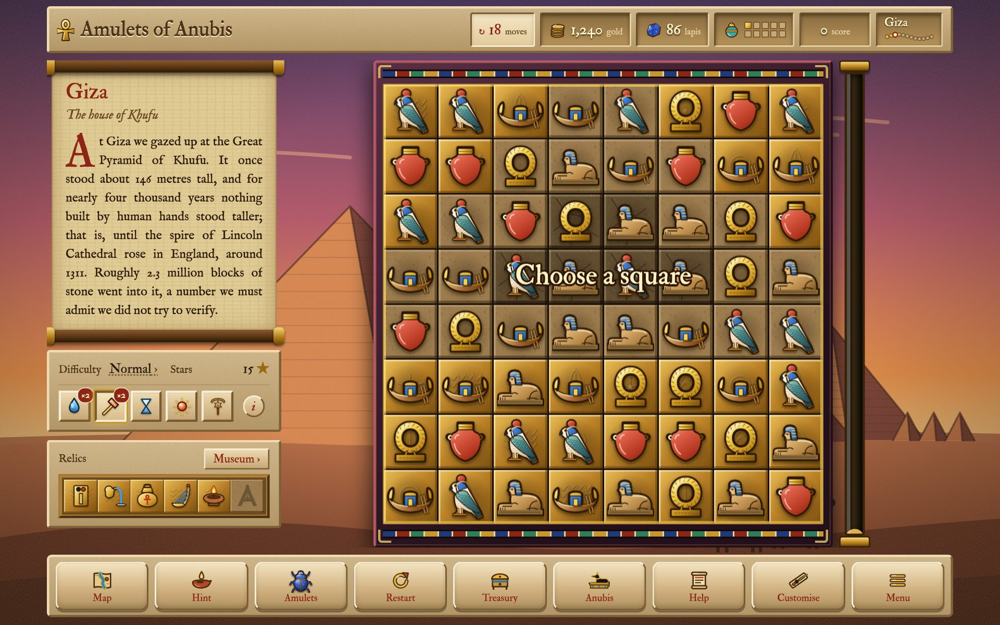

*A boon with `target: true`, waiting for the player to choose a square.*

### Making your own: the Blessing of Hapi

Hapi was the God of the Nile's yearly flood, the water that softened the
fields. Let's make a boon in His name that **softens every thick stone in the
column the player chooses**, turning it into plain bare stone. Nothing in the
list does that. The Cord of Seshat is close, though: it works on the
**row** the player chooses. So we copy it and change it.

**Step 1: find the nearest entry.** In `BOON_EFFECTS`, the Cord's effect is
`cord_row`:

```js
	cord_row: {
		target: true,
		use: async (b, sq) => {
			const r0 = (sq / COLS) | 0;
			const c0 = sq % COLS;
			let n = 0;
			for (let col = 0; col < COLS; col++) {
				const j = r0 * COLS + col;
				if (core.mask[j] && core.floor[j] > 0) {
					core.floor[j]--;
					...
```

It goes along the chosen **row** (`r0`), one column at a time, and takes one
layer off every stone. We want to go down the chosen **column**, one row at a
time, and only touch **thick** stone.

**Step 2: write the new entry.** Just above `cord_row`, add:

```js
	// every thick stone in the chosen column becomes plain bare stone
	thin_column: {
		target: true,
		use: async (b, sq) => {
			const c0 = sq % COLS;
			let n = 0;
			for (let row = 0; row < ROWS; row++) {
				const j = row * COLS + c0;
				if (core.mask[j] && core.floor[j] > 1) {
					core.floor[j] = 1;
					flashes.set(j, 1);
					n++;
				}
			}
			bgDirty = true;
			beams.push({ dir: 'v', idx: c0, life: 1 });
			sfx('blessing');
			boonPopup(b, !n, { x: c0 + 0.5, y: 0.8, life: 1.6, size: 0.46, col: '#bfe8ff' });
			updateHUD();
			await settle();
		},
	},
```

Line by line:

| Line | What it does |
|---|---|
| `thin_column: {` | the name a boon file will use in `"effect"` |
| `target: true,` | the player chooses a square first |
| `use: async (b, sq) => {` | what happens; `b` is the boon, `sq` the chosen square |
| `const c0 = sq % COLS;` | the column of the chosen square |
| `let n = 0;` | a count of the stones we soften, starting at none |
| `for (let row = 0; row < ROWS; row++) {` | for every row, top to bottom… |
| `const j = row * COLS + c0;` | …`j` is the square in that row and our column |
| `if (core.mask[j] && core.floor[j] > 1) {` | if it's part of the floor **and** thick… |
| `core.floor[j] = 1;` | …it becomes bare stone (**the rule**) |
| `flashes.set(j, 1);` | a flash of light on that square |
| `n++;` | count it |
| `bgDirty = true;` | the floor changed, so it must be painted again |
| `beams.push({ dir: 'v', idx: c0, life: 1 });` | a beam of light down the column (`'v'` for vertical; `'h'` is a row) |
| `sfx('blessing');` | the sound of a blessing |
| `boonPopup(b, !n, ...)` | float the boon's words over the column; if `n` is 0 (no thick stone), the "nothing to do" words instead |
| `updateHUD();` | update the numbers at the top |
| `await settle();` | wait until the board is still |

There is no `amount` line: this boon has no number to set. Notice that the
rule is two lines (`core.floor[j] = 1;` and the `if` above it); the rest
makes it feel like something happened. A boon with no show works, but feels
broken.

**Step 3: make the boon.** `python3 scripts/new.py boon hapi` writes
`content/boons/11-hapi.jsonc`, a working boon to change. Set:

```jsonc
	"name": "Blessing of Hapi",
	"short": "Hapi",
	"description": "Softens every thick stone in the column you choose.",
	"effect": "thin_column",
	"popup": "Hapi softens the stone",
	"popup_when_nothing": "No thick stone there",
```

and delete the `"amount"` line. Keep the words free of `{n}`, since this boon
has no number. The build reads the effect names from the code, so it
accepts `thin_column` as soon as your entry is there.

**Step 4: a picture and a way to be found.** Draw
`images/icons/boons/hapi.svg` (copy another boon's icon to start), or write
`"icon": "flood"` to borrow one for now. Then give the boon out somewhere: as
a trial's prize (`"boon": "hapi"` in a trial file), in Anubis's stall, or as
a river event's reward.

**Step 5: try it.** Build, and open `dist/try-it.html`: try-out mode holds
one of every boon, so Hapi is in the row beside the board. Pick a stop with
thick stone, click Hapi, and click a column.

**Step 6: tidy up.** Add a line for `thin_column` to the list of effects in
the comment at the top of the boon files, so the next person knows it
exists. Then run the smoke test, which plays the game for a moment and says
if anything went wrong:

```sh
node tools/screenshots/smoke.mjs
```

### Useful things to call

These are the pieces the existing entries use, and the ones you are most
likely to want.

| To… | Use |
|---|---|
| change the moves | `core.movesLeft += 3;` |
| take a layer off a stone | `core.floor[j]--;` (then `bgDirty = true;`) |
| clear amulets as if matched (gilding under them, cascades after) | `await cascade(null, [j1, j2, ...], true);` |
| light up a square | `flashes.set(j, 1);` or `burst(column, row, 4);` for sparks |
| a beam along a row or column | `beams.push({ dir: 'h', idx: row, life: 1 });` (`'v'` for a column) |
| golden orbs flying from one square to others | `orbs.push({ from: j, to: j2, t: 0, dur: 0.5 });` |
| a sound | `sfx('blessing')`, `sfx('crack')`, `sfx('bomb')`, `sfx('moves')` … |
| the boon's words on the board | `boonPopup(b, nothingHappened, { x, y, life, size, col });` |
| update the numbers at the top | `updateHUD();` |
| wait for the board to be still | `await settle();` |

### When it doesn't work

- **The build says the effect is unknown.** Check the spelling is the same
  in the boon file and in the code, and that your entry is inside
  `BOON_EFFECTS` (between its `{` and the closing `};`).
- **The game shows a blank page.** A bracket or comma is missing. Open the
  browser's console (F12) and read the red message: it names the line.
- **Nothing seems to happen.** Did the floor change but not the picture?
  You need `bgDirty = true;`. Did nothing at all happen? Check your `if`:
  maybe no square matched it.

### The other lists

The same idea works for the other kinds. Each list has a comment above every
entry saying what it does, so reading two or three of them is the best
start.

| To make a new… | Add an entry to | In | Further reading |
|---|---|---|---|
| boon effect | `BOON_EFFECTS` | `src/game/07-trials-boons.js` | [Part 2: a new boon effect](part-2-the-engine.md#a-new-boon-effect) |
| badge power | `BADGE_POWERS` (the rule) and `BADGE_SHOWS` (how it looks) | `src/01-core.js`, `src/game/21-moves.js` | [Part 2: a new badge power](part-2-the-engine.md#a-new-badge-power) |
| curse or omen effect | `HARDSHIPS` | `src/01-core.js` | [Part 2: a new hardship](part-2-the-engine.md#a-new-hardship-for-curses-and-omens) |
| trial goal | `TRIAL_GOALS` in `build.py`, and measure it in `trialProgress()` | `build.py`, `src/game/07-trials-boons.js` | [Part 2: a new trial goal](part-2-the-engine.md#a-new-trial-goal) |

**Rules and show are kept apart** for badges: the rule goes in
`src/01-core.js`, which has no drawing or sound in it, because the robot
player of chapter 8 plays that file to test the balance. How a badge looks
and sounds goes in `src/game/21-moves.js`.

## 10. If something goes wrong

**The build stops and says a file has a problem.** Read the line it
prints: it names the file, the line, the text and what to do. Fix that one
thing and build again.

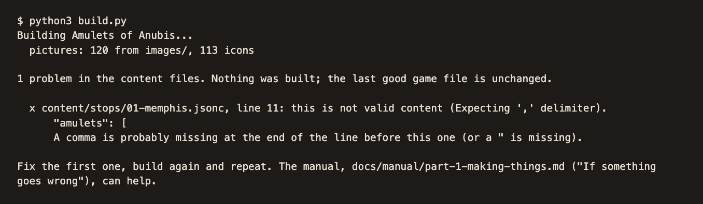

*Here a stop's `"moves"` was written as `"lots"`. Nothing is built until
it's fixed, and the game you had before still works.*

The most common slips:

1. A missing comma between two lines, or a missing quote.
2. A field name the build doesn't know. It suggests the closest one.
3. A bracket deleted by accident when copying a file.

**Try-out mode shows something odd.** Its save is separate. In try-out
mode, *Save and restore → Complete reset* clears only the try-out save.

**The game shows a blank page**, although the build said `Done`. Press
**F12** (on a Mac, ⌥⌘I), open the **Console** tab, and read the red
message: it names the problem and usually the line.

When in doubt, change one thing at a time: change, build, check, then the
next.

## 11. Sharing your version

- **The file itself.** `dist/amulets-of-anubis.html` is the whole game.
  Send it, put it on a USB stick, or put it on any website.
- **An app.** `./build.sh` also makes the Android app and the desktop apps
  for Windows, macOS and Linux. The [build guide](../build-guide.md) says
  what each needs.
- **The licence.** The code is GPL 3 or later, the pictures CC0: you may
  share your version, and the code of it stays free. The README has the
  details.
