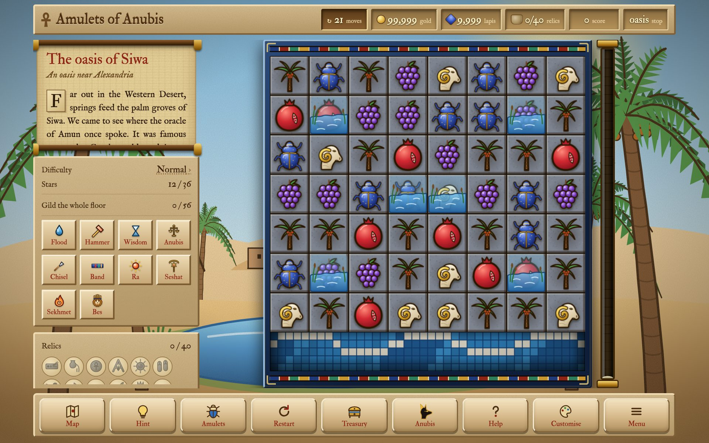
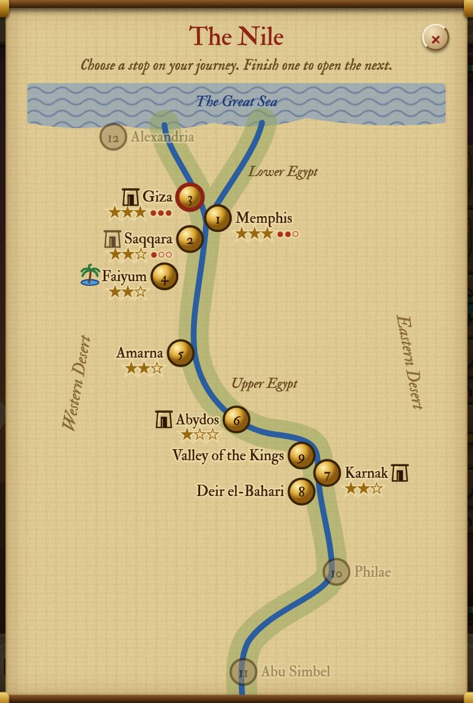
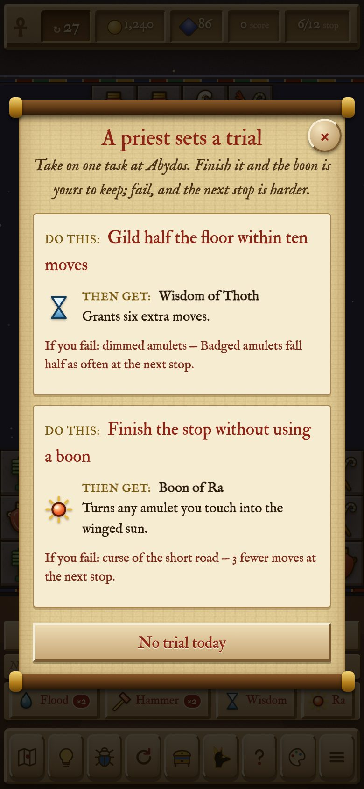
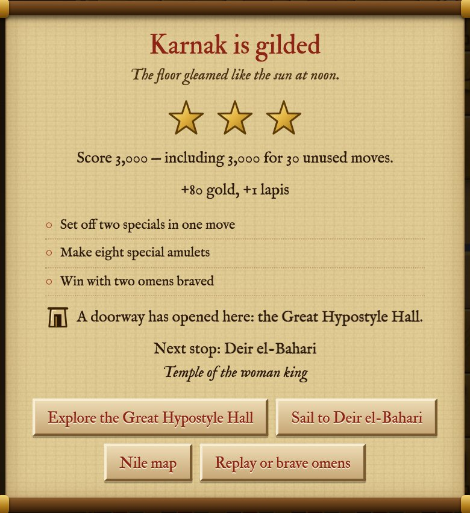
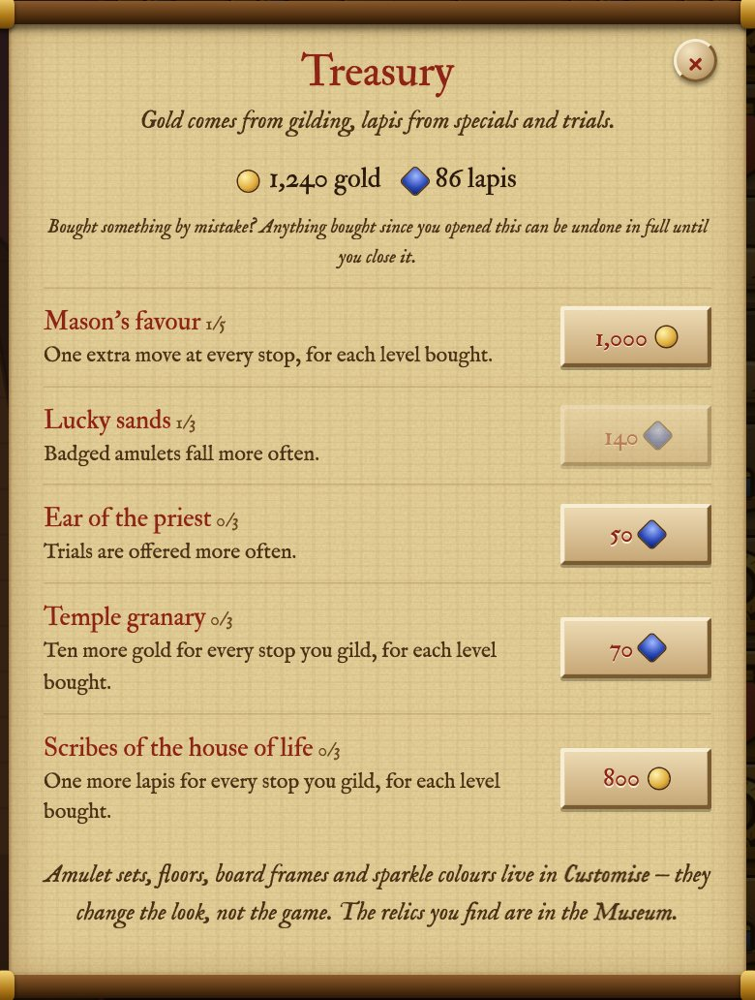
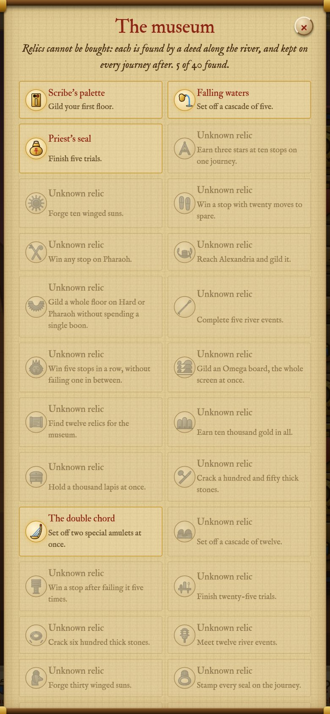
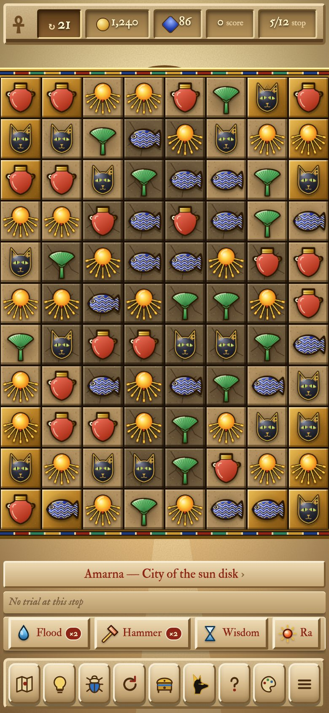
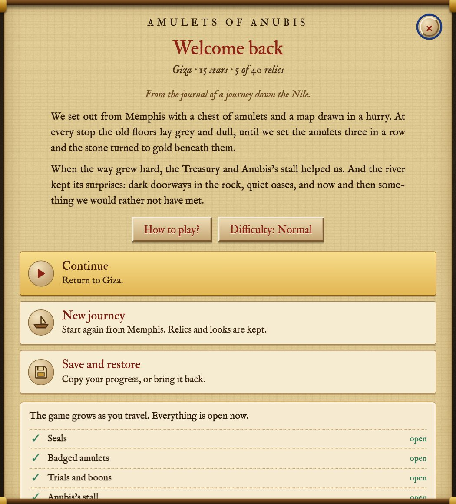

# Screenshots

These are all taken from the game itself, by `tools/screenshots/take.mjs`, so
they stay up to date whenever the game changes. Most are from a desktop
browser; the two narrow ones are from a phone.

<figure class="wide"><figcaption><b>A tomb by torchlight.</b> Some amulets lie buried in sand: a match beside one brushes it clean.</figcaption></figure>
<figure class="wide"><figcaption><b>An oasis.</b> Siwa, far out in the Western Desert: some amulets lie under water.</figcaption></figure>
<figure><figcaption><b>The Nile map.</b> Twelve stops, their stars and seals, and doorways to explore.</figcaption></figure>
<figure><figcaption><b>A doorway.</b> Each tomb or temple opens with a short, true note on the place.</figcaption></figure>
<figure><figcaption><b>On the river.</b> Between stops, a puzzle or a choice: here, the old ferryman.</figcaption></figure>
<figure><figcaption><b>A trial.</b> A priest sets a task; finish it for a boon.</figcaption></figure>
<figure><figcaption><b>A stop gilded.</b> Stars, rewards, seals, and a doorway newly opened.</figcaption></figure>
<figure><figcaption><b>A gilded stop.</b> Its seals, omens to brave for a richer reward, and its doorway.</figcaption></figure>
<figure><figcaption><b>The Treasury.</b> Lasting upgrades, bought with gold and lapis.</figcaption></figure>
<figure><figcaption><b>The Museum.</b> The relics you have found, one for each deed along the river.</figcaption></figure>
<figure><figcaption><b>Anubis's stall.</b> One-time help, for gold or lapis.</figcaption></figure>
<figure><figcaption><b>Customise.</b> Amulet sets, floors, frames and sparkles, earned by playing.</figcaption></figure>
<figure><figcaption><b>On a phone.</b> The board runs edge to edge; the boons sit below it.</figcaption></figure>
<figure><figcaption><b>The title screen.</b> The game grows as you travel, one part at a time.</figcaption></figure>
<figure><figcaption><b>How to play.</b> Every amulet, special, boon and rule, with pictures.</figcaption></figure>

To add one, give `take.mjs` a new scene (the list is called `SCENES`) and add
a picture for it here.
