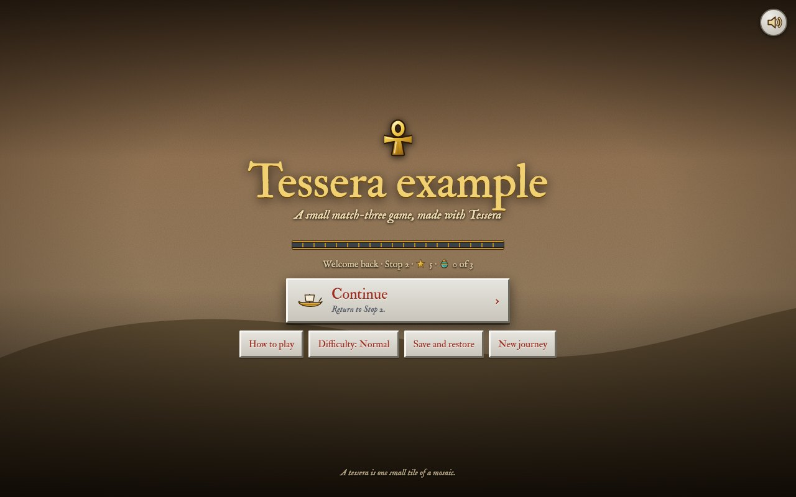
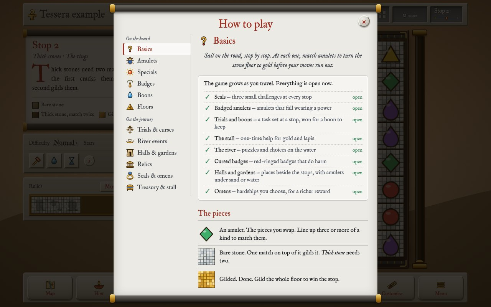
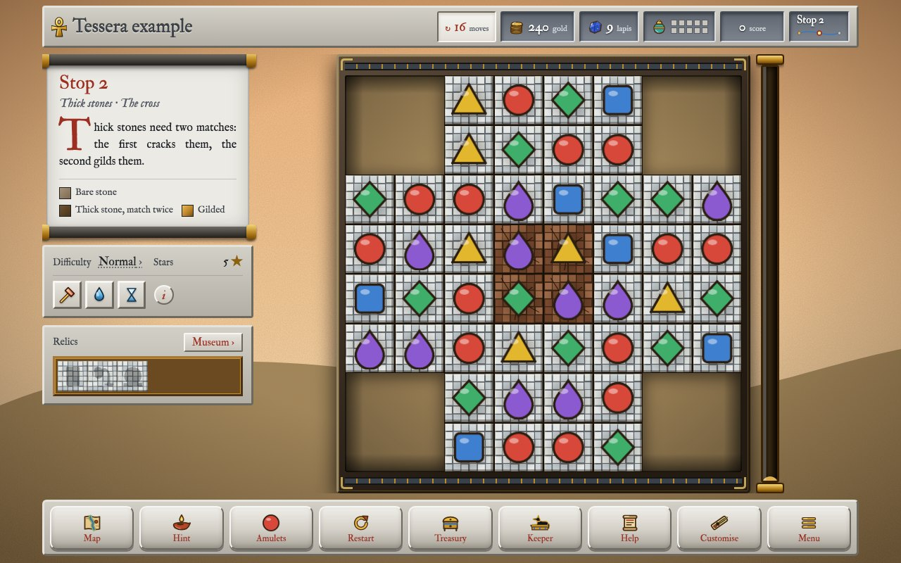
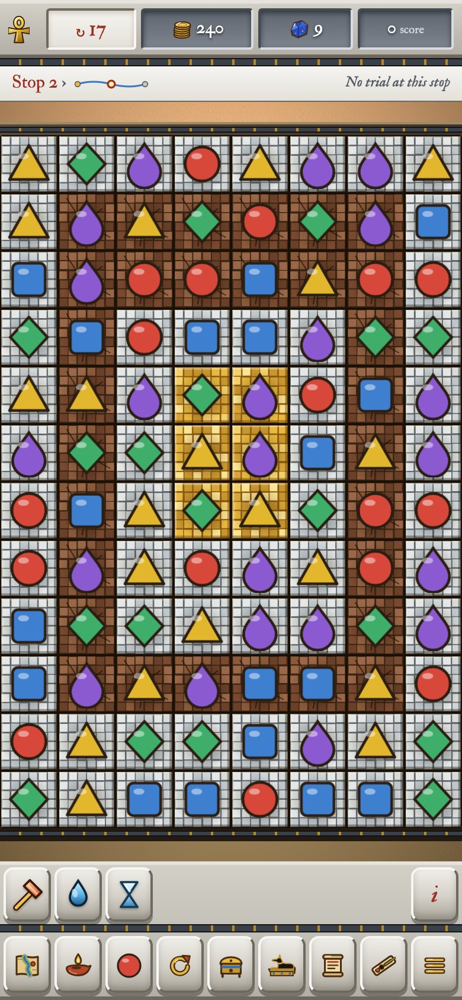

# Part 2: The engine

*Part 2 of the Tessera manual, for developers: how the engine works on
the inside and how to change it. If you'd like to make a game with content
files and pictures, part 1 is what you're looking for.*

This part is meant for people who'd like to change the engine itself:
add a new kind of rule, a new screen or a new tool. I assume you've read
chapter 4 of part 1 ("How a game is put together") and that you know a
bit of JavaScript and Python. (Part 1 can be found beside this part in
Tessera and in a game's own `docs/manual/`.)

All the paths below are written the way they look inside a game, with the
engine in its `engine/` folder. In the Tessera repository itself, the
same files can be found at the top instead.

**Contents**

1. [The shape of it](#1-the-shape-of-it)
2. [The build](#2-the-build)
3. [The source](#3-the-source)
4. [The rules](#4-the-rules)
5. [The running game](#5-the-running-game)
6. [Screens and the interface](#6-screens-and-the-interface)
7. [The systems](#7-the-systems)
8. [Sound and music](#8-sound-and-music)
9. [Extending the engine](#9-extending-the-engine)
10. [Saving](#10-saving)
11. [Balance and the simulators](#11-balance-and-the-simulators)
12. [Performance](#12-performance)
13. [The stylesheet](#13-the-stylesheet)
14. [Testing](#14-testing)
15. [Packaging](#15-packaging)
16. [House style](#16-house-style)
17. [The Godot version](#17-the-godot-version)

---

## 1. The shape of it

A game made with Tessera is **one HTML file** that is meant to keep
working, unchanged, for decades. That's the most important thing about
the engine. Four rules follow from it and every change to the engine has
to keep all of them:

- **One file.** The build writes `dist/<file>.html` (the `file` in the
  game's `edition.jsonc`). That file is the game. It runs from
  `file://` with no server.
- **No network.** No CDNs, web fonts, analytics or `fetch`. The fonts are
  embedded. `grep -c "https://" dist/<file>.html` must print `0`.
- **No dependencies.** Plain HTML, CSS and JavaScript, no packages,
  frameworks or bundlers. The build needs Python 3; the game needs a
  browser. Pictures are files; sounds and music are synthesised, unless a
  game brings recordings of its own.
- **Old WebViews.** A game may be wrapped in an Android app, from Android 7
  up. Avoid what WebView lacks, or give it a fallback.

The organising idea is that **content and code are separate**. Everything
a player sees or reads that isn't a rule is content, one file per thing in
the game's `content/`. The rules, the drawing, the sound and the screens
are code, in `engine/src/`. `engine/build.py` is the seam between the
two: it checks the content and then puts it into the code.

```
build.py                   (the game's) runs engine/build.py for this game
edition.jsonc              the game's name, file, save keys and code prefix
content/                   the content, one file per thing, plus text.jsonc and settings.jsonc
images/                    every picture; icons in images/icons/<group>/
web/                       (optional) the game's own look: css/, fonts.css
engine/build.py            checks the game, joins engine/src/ and engine/web/, writes dist/
engine/src/01-core.js      the rules, with no browser code (the simulators run it)
engine/src/00-open.js      loads and migrates the save
engine/src/02-pictures.js  loads the pictures before the game starts
engine/src/03-themes.js    per-stop themes, built from the stops
engine/src/04-boards.js    frame colours, amulet sets, floor squares
engine/src/game/           the running game, one file per part (listed in its README)
engine/web/shell.html      the page, with holes the build fills
engine/web/css/            the stylesheet, one file per part of the screen, in a plain look
engine/web/fonts.css       the two typefaces, embedded
engine/tools/              simulators, the smoke and edge tests, the formatter
engine/example/            the example game
engine/godot/              the Godot version (chapter 17)
```

**The engine and the game.** Everything in `engine/` is the engine and
makes any game from any folder of content. Nothing in it names a place, a
God or an amulet: it reads them from the game's folder, the one that holds
`edition.jsonc` (how it finds that folder is in Tessera's README). That
goes for the look too: the engine's own stylesheet is plain and a game
brings its own colours, textures, typefaces and tab picture (chapter 13).
So a change to the engine goes in a commit of its own that touches only
`engine/`. A change to a game's content goes in the next one. (Tessera's
own `docs/games.md` explains why and how fixes travel between Tessera and
its games.)

## 2. The build

`engine/build.py` runs in this order and **writes nothing if any step fails**,
so a broken content file never ships a broken game.

1. **Name lists from the code.** Some names a content file may use are
   defined in the code and the build reads them from it by pattern:
   boon effects (`BOON_EFFECTS` in `engine/src/game/07-trials-boons.js`), badge
   powers (`BADGE_POWERS`) and hardships (`HARDSHIPS`, both in
   `engine/src/01-core.js`). Others are listed at the top of `engine/build.py`:
   instruments, scales, board modes, trial goals, upgrade effects,
   condition names, special pictures, colour changes. Add to those by
   hand when you add one in the code.
2. **The edition.** `edition.jsonc` is checked (its keys, the starting
   looks it names) and reaches the code as `CONTENT.edition`.
3. **Pictures and icons.** Every file in `images/` goes into `PICTURES`;
   every SVG in `images/icons/<group>/` into `ICONS`, cleaned of comments.
4. **Content.** Each folder in `content/` is read in file-name order. Files
   may carry `//` comments and trailing commas, which are stripped with
   line positions kept, so errors point at the right line. Each kind has a
   validator (`stop()`, `boon()`, `badge()` and so on) built on a small
   `Check` class that reports by file, field and line and suggests the
   nearest name for a typo. The `KINDS` table ties folders to validators.
5. **References.** Anything that names another thing (a stop's amulets and
   floor shapes, a relic's condition, a stall item's boon, a trial's boon)
   is checked once everything is read (`LATER`).
6. **Settings and text.** `settings()` parses `content/settings.jsonc` into
   the numbers the code reads as `CONTENT.settings`. `content/text.jsonc`
   is checked against the code: every `T('…')` and `{{…}}` must have a key.
   Keys the code builds from an id (`T('codex.tabs.' + id)`) can't be found
   by searching, so they are listed in `TEXT_FAMILIES`.
7. **Joining.** `engine/src/00-open.js`, `02-pictures.js`, `03-themes.js`,
   `04-boards.js` and then every file in `engine/src/game/` in name order are
   joined and `engine/web/shell.html` wraps them in one function
   (`(() => { … })();`), so the game's names stay its own. `engine/web/css/` is
   joined in name order, with the game's own stylesheet files in their
   place (chapter 13).
8. **Filling the holes.** The build puts the checked content, pictures,
   icons, styles, fonts and code into its placeholders:
   `/*CONTENT*/null`, `/*IMAGES*/null` and `/*ICONS*/null` in the code
   (a space before the `null` is fine), `/*STYLES*/`, `/*FONTS*/`,
   `/*CORE*/` and `/*UI*/` in `engine/web/shell.html`. **These placeholders are
   load-bearing**: if one of the code's three is missing, the build stops
   and says so.

`--check` validates without writing. `--watch` rebuilds on save.
`--content-json` prints the checked content and nothing else, which is how
the simulators get it (`engine/tools/load-core.js`). The build also writes
`dist/try-it.html`, which opens try-out mode at the file changed last and,
when `rsvg-convert` (librsvg) is installed, `dist/art-references/`: every
picture in `images/` as a PNG, in the same folders, for showing the art
outside the game (`engine/tools/art-references.py`; only changed pictures are drawn
again).

### The docs that follow the code

Two parts of the engine's docs are written by the build itself, so they
can never fall behind:

```sh
python3 engine/build.py --docs
```

writes the appendix of the [content reference](../content-reference.md)
("every name the build knows") from the names in the code. It also writes
[a map of the code](../code-map.md) from the note at the top of every
file. It then checks the rest of the reference, which is written by hand:
every setting of every kind of content file needs a row in its table,
"yes" and "no" in the Needed column have to agree with what the build
really insists on (it tries each file without each setting to find out)
and the tables of boon effects, badge powers, hardships and conditions
have to list exactly what the code knows. If anything doesn't match, it
says what and where. Its code can be found in `engine/tools/reference.py`.

So when you add a setting, a boon effect or a new file, run it once
and add the row it asks for. When you change what a file is for, change
the note at its top: that's what the map shows.

### The manual as a website and a book

```sh
python3 engine/tools/docs/build.py --pdf
```

makes the manual into a website in `dist/docs/` (open `index.html`; it
needs no server and no internet) with a search over every page, and into
a PDF beside it, on A4 and on A5 (smaller pages, which read better on a
phone; `--a4` or `--a5` makes only one). Which pages there are, their order and which of them go into the
PDF are listed in `docs/site.json`. The looks are in
`engine/tools/docs/looks/` and `--look` picks one; a game can bring its
own (a stylesheet in its folder, named in `site.json`). The `dist/docs/`
folder can be copied anywhere as it is, to a web server for instance. The PDF is printed by
`engine/tools/screenshots/pdf.mjs`, so it needs Playwright like the
screenshots.

## 3. The source

Everything in `engine/src/` (apart from `01-core.js`, which is loaded on its
own) runs inside **one function**, top to bottom, in file order. Each file
is complete JavaScript on its own, so an editor can read it. So:

- **The numbers are the order.** A `let` or `const` used while the game
  starts (by `fit()`, or anything the boot calls) must be declared in an
  earlier file than its first use, or the game throws on load (a temporal
  dead zone). Functions are hoisted and don't mind.
- **A new file** needs only a name with the right number.
- **Each file starts with a note** saying what it is for, its main
  functions, where they are called from and what it changes in the
  save. Read the note first; keep it up to date when you change the file.
  An editor that reads `jsconfig.json` (VS Code, Zed, Gram) can also follow
  any name to where it is defined.
- **To find something**, search `engine/src/game/` for its name. Headings like
  `// ---------- sound ----------` mark the parts inside a file.
- **HTML in the code** is written in `` html`...` `` strings, laid out one
  element per line and indented like the page it makes. The `html` helper
  (`02-screen.js`) drops the line breaks and the indentation after them,
  so the page gets the same HTML as if it were written on one line. A
  space that should show goes before the line break.
- **One style.** The code and the stylesheet are kept in one style by
  Prettier, with the settings in `.prettierrc`: tabs, lines up to 110
  characters, one CSS property per line. `engine/tools/format.sh` lists the files
  out of style and `engine/tools/format.sh --write` fixes them (it fetches
  Prettier the first time; the game never needs it). An editor with a
  Prettier plugin reads the same settings, so format on save agrees.
  `engine/src/game/README.md` lists what each file holds.

`engine/src/01-core.js` contains the rules and has **no browser code** at all: no
`document`, `window`, canvas or audio. That is what lets the simulators run
the real rules in Node. Keep it that way.

The code is in one plain style throughout: tabs, one statement per line,
spaces after commas and around operators, braces on the same line, single
quotes, lines up to about 110 characters, a blank line between functions.

## 4. The rules

### The board

`Core` (in `01-core.js`) holds three flat arrays of length `COLS × ROWS`:

- `mask[sq]`: is this square part of the floor;
- `floor[sq]`: layers of stone left (`0` gilded, `1` bare, `2` thick);
- `cells[sq]`: the amulet there, `{type, special, id}`, with `cover` (a
  cover's id, or none) and `layers` (of it left), or `null`.

The rules are written in a small set of **helpers** at the top of
`01-core.js` (part 1, chapter 11, lists them): where squares are
(`rowOf`, `neighbours`, `around`, `rowSquares` ...), which hold what
(`bareStones`, `plainAmulets`, `edgeOfFloor`, `squaresWhere` ...), choosing
(`pickSome`, `pickOne`, both drawing from `shuffled()`, one shuffle for
every rule) and changing (`thicken`, `coverAmulet`, `breakCover`,
`makeSpecial`). Every list of squares they return is in board order, so the
same random numbers choose the same squares in the web game and in Godot.
Use them in a new rule; a new helper goes beside its kind, with its twin in
`godot/rules/rules.gd`. `node tools/rules-test.js` checks every helper,
cover, special, badge power and hardship on small boards of their own.

`Core.play(a, b, each)` is one whole move with nothing shown (swap, clear
and fall until still, spread covers, shuffle a stuck board, use a move):
the simulators and the parity test all play through it and the game's
`attemptSwap()` and `cascade()` do the same with pictures.

`COLS` is the number of **columns** and `ROWS` the number of rows; boards
are often taller than wide, so index by `sq = row * COLS + col` and never
assume a square. `COLS` and `ROWS` are module-level `let`s set by `setBoardSize()` before
a stop is built.

### A move

`isValid` → `swap` → `clearStep` → `gravity` → `clearStep` again, until
nothing clears. `clearStep` finds runs of three or more, decides which
specials are made, sets off specials caught in the blast (chains
included), fires the powers of cleared badges, reduces the floor under
everything cleared and **returns lists of what happened**. The game layer
animates those lists and never works out a rule itself, which is why a
bot can play the same code headlessly.

**Specials** come from the shape of a match: four in a row makes a banded
amulet, an L or T a ringed one (a star if one arm is four long) and five
in a row a sun. Two specials swapped together combine
(`COMBO`).

**Badges** are marks a new amulet can fall wearing, at the difficulty's
`powerChance`, picked by each badge's `weight` (`pickBadge()`). When a
badged amulet clears, `clearStep` calls its power from `BADGE_POWERS`,
which records what it did (`targets`, extra gilding) for the game to show.
Cursed badges are kept rare and switched off on Relaxed and in river events.

### Building a stop: `stopOptions()`

**Every board is built through `stopOptions()`**, the game's and the
simulators' alike, so a test plays the stop a player gets. It takes the
stop, the difficulty, the board mode and size, Treasury upgrades,
persistence, omens, a curse and whether badges have arrived yet and
returns the options `Core` is made with: the floor plan, the moves, the
badge chance. Hardships (curses and omens) change these options through
their `options(o, n)` part and change the filled board through `board(core, n)`.

### Board modes

`BOARD_MODES` has one entry per board: `classic` (8 wide), `grand`,
`ruins` (generated ruins, `ruinsPlan()`) and `omega` (as large as the
window, `omegaPlan()`). Each gives its `layout()`, how its `moves` scale
and `tall` (extra moves for a tall board). Omega is `dynamic`: its size is
measured from the window when a stop starts, by `omegaSize()` and anything
that previews a board must measure the same way. Generated plans must pass
`allMatchable(rows)`: every playable square must lie on some run of three.

### Conditions

Relics, looks, seals and staging use one condition language: a block like
`{"stops_won": 10, "win_on_difficulty": "Hard"}` where every entry must
hold. `conditionMet(when, s)` checks it; `CONDITION_COUNTERS` contains the
counted ones and the win conditions read `s.lastWin`. `needProgress()`
in `game/09-unlocks.js` gives the "7 of 9" shown on a locked look and
`conditionText()` the words.

## 5. The running game

- **State** (`game/05-state.js`): `startLevel()` builds a stop, sets up the
  board frame, the scenery, the note beside the board and the HUD.
  `updateHUD()` refreshes the numbers and the gilding tube.
- **Drawing** (`game/19-draw.js`): one canvas. `frame()` updates and draws
  the amulets, badges and effects each animation frame. The floor and its
  shadows are drawn once into an offscreen canvas (`game/01-caches.js`) and
  copied; anything that changes `core.floor` must set `bgDirty = true`.
- **Moves** (`game/21-moves.js`): swapping, `showClear()` animating what
  `clearStep` returned, falling, cascades, scoring and earnings.
- **Input** (`game/22-input.js`): pointer, drag and keyboard. Keyboard play
  (arrows, Enter, Escape) must keep working.
- **Effects** (`game/20-effects.js`): sparks, beams, orbs, rings, flashes,
  popups and vibration, all plain arrays that `frame()` draws.
- **Busy**: while a move plays out, `busy` is true and input waits.
  `settle()` returns a promise that resolves when the board is still.

## 6. Screens and the interface

The interface has a small set of rules. Follow them and a new screen looks
like the rest without new CSS.

### Scrolls: `showMsg()`

Almost every screen is a scroll (`#ovMsg`), opened with
`showMsg(html, actions, opts)` in `game/23-scrolls.js`. Each action is
`[label, what it does]`, with an optional third part saying how it looks:

```js
showMsg(html, [
	[Tplain('win.sail', { stop: next.name }), () => goNext(i + 1), { kind: 'go', sub: next.sub, icon: iconSvg('ui', 'boat') }],
	[Tplain(placeKey(door, 'explore'), { name }), () => startChamber(door), { kind: 'card', dark: true, icon: iconSvg('map', placeIcon(door)) }],
	[Tplain('win.map'), openMap, { kind: 'quiet', icon: iconSvg('dock', 'map') }],
], { noClose: true });
```

- **`go`**: the usual next step. **One per scroll**: a big stone
  button, full width, with a line under it (`sub`) saying where it goes.
- **`card`**: another way to go, smaller, with a line under it.
- **`dark: true`**: the way into a tomb, in torchlit brown; with
  `oasis: true`, blue daylight.
- **`quiet`**: everything else (the map, replaying, leaving): small
  buttons in a row at the foot. A single `quiet` beside a lone `go` shares
  its line instead, as tall as the big button; give it `short` words
  ("Leave") for phones, where its long ones won't fit.
- **`exit`**: a way out that changes nothing ("No trial today", "Back to
  the board"): full width at the very foot, after a ×. `exitButton()`
  makes the same button outside `showMsg` (the map's).
- **`hidden: true`** starts an action hidden, for a screen that swaps its
  big button (the stop card does, per tile).
- An action with none of these is a plain button, as in the shops.

`opts.noClose` hides the × and blocks Escape, for scrolls that need a
decision (winning, losing). `opts.onClose` says what closing means when it
isn't "back to the board": the stop card's × goes back to the map.

### The visual language

- **Buttons are stone**: a gradient in the `--stone-*` colours with a
  bevelled border
  (light top-left, dark bottom-right). **Chosen is pressed in**: the bevel
  reversed, a lighter face and a 2 px gold ring. Tabs, tiles, omen cards
  and the boon being aimed all use this.
- **Places have their own colour**: torchlit brown for a chamber in the
  `tomb` setting, blue daylight for one in the `oasis` setting, the stop's
  scenery for the title screen.
- **Dividers** are the band of the board's frame (`.title-hr`), in the
  game's `--band` colours.
- **No scroll bars where they can be avoided.** Lay out to fit; when text
  might not fit, show whole lines and a way to read the rest.
- **Scrolls are a column of rod, sheet and rod.** The rods are
  `flex: none`, or a long scroll squeezes them thin.
- Words go through `T()`; nothing English is written into the code.

### The title screen

The title screen is its own layer, `#ovTitle`, over the scenery of the stop
you're at. `openTitle()` (`game/15-title.js`) sets `body.at-title`, which
hides the rest of the game so the scenery shows through. At start-up the
page carries `body.booting`, which hides everything but the overlays until
the title is up, so the board never flashes first. `closeOverlays()` takes
`at-title` away.



### The Menu

`openMenu()` (`game/14-menu.js`): the big "Back to the board", the band,
**eight tiles** in two rows of four and the three ways out of the game
(title screen, save and restore, a new journey) small at the foot. A tile
carries a word of state where it helps (`Normal`, `1 of 3`, `music off`)
and its full description as a tooltip. Until the stall opens on a first
journey, its tile is Learning pace, so the rows stay full. A new entry
should replace one, or become the ninth and tenth together.


### How to play

`openHelp(tab)` (`game/25-codex.js`). The chapters are `CODEX_GROUPS`, in
two groups, each with a picture in `images/icons/codex/<id>.svg` and a name
in `codex.tabs`. On a wide screen they run down the margin as an index; on
a narrow one (`CODEX_NARROW`, 640 px, the same as the stylesheet) How to
play opens on a contents page (`openHelp('contents')`) and each chapter
has the next and previous at its foot. A chapter waits for its stage on a
first journey (`CODEX_STAGE`). A game's own website can read
`CODEX_GROUPS` from this file to lay out its How to play the same way.



### The stop card

`openStop(i)` (`game/28-map.js`): with more than one part to show (seals,
omens, a doorway), each is a tile with its gist ("1 of 3", "2 braved",
"explored") and only the chosen one is open. The big button follows the
tile: "Set out" onto the stop, or into the doorway on its tile.


### The column beside the board

On a desktop, the board has a column beside it: the stop's note, a tablet
(difficulty, stars, trial, boons) and the relics. It must fit without
scroll bars:

- **The note** shows whole lines only. `fitNote()` (`game/05-state.js`)
  measures it; if it overflows, the key to the stones goes first, then
  the note is cut to whole lines and ends in "Read on", which opens it in
  a scroll. A `ResizeObserver` on the tablet runs it again when the tablet
  grows.
- **The boons** are icons with names on a tall window and icons only when
  the window is shorter than 820 px. A **?** after them opens How to play
  at Boons. On a phone they are icons only, at least 44 px, for thumbs.
- **The relics** are one row, found ones first, with a Museum button; the
  row opens the Museum too.



On a phone the column becomes a strip under the board and the note opens
from it:



### Words on screen

Every player-facing word is in `content/text.jsonc`. `T('win.title',
{stop})` returns the text with `**bold**`, `*italic*` and new lines made
HTML, `{stop}` filled in and `{n|stone|stones}` chosen by number;
`Tplain()` gives plain text for titles and labels. In `engine/web/shell.html`,
`{{hud.moves}}` is filled at build time. `plainText()` strips HTML for
attributes such as `title`.

### Icons

Icons are SVG files in `images/icons/<group>/`, never strings in the code.
`iconSvg(group, name, attrs)` gives a whole icon; `iconArt(group, name)`
its inside, with its `<defs>` moved once into the shared defs, because
Firefox loses a gradient whose first copy is hidden. So gradient ids must
be unique across icon files (only `relicGold` is shared on purpose). In
`engine/web/shell.html`, `{{svg:dock/map}}` puts an icon in at build time.

### Staging and "new"

A new player meets the game's parts one at a time: `STAGES` and
`stageOn(id)` in `game/26-stages.js`, with the stop each arrives at in
`settings.jsonc`. Until its stage, a part is hidden, not just quiet: its
buttons, Menu tile, How to play chapter and map marks. `announce()` shows a
banner; `markNew(key)` puts a red dot on the button where something can be found until the
player opens it (`clearNew(key)`). A new stage needs `title`, `text` and
`what` in `text.jsonc` (`stages.<id>`).

### Accessibility

Keep keyboard play working, `aria-label`s on icon buttons, focus on the
first sensible button of a scroll (the title screen's sound button comes
last in its markup for this reason) and respect less motion: the player's
choice in Settings, or the phone's own "reduce motion" (`applyMotion()` in
`00-open.js` sets `reduceMotion` for the code and the `calm` class on
`<html>` for the stylesheet). In CSS write `:root.calm .thing` rather than
`@media (prefers-reduced-motion)`, so the setting can override the phone.

### Settings

Settings (`openSettings()`, `14-menu.js`) has five parts as tiles, each
opening one: sound and music, vibration, colours, motion and effects and
this device. Sound, vibration, colours and motion are in the save (`colours`,
`motion`); how the board is drawn (`deviceSetting('renderer')`, kept under
the edition's `device_prefix`) and fewer effects
(`deviceSetting('effects')`) belong to the device and are kept in the browser
(`deviceSetting()`), so a save code taken to another phone doesn't bring
them. Effects on "Automatic" turn down only on a phone that reports 4 GB of
memory or less, after a fifth of the frames during cascades were slow at two
different stops (`watchEffects()`, `19-draw.js`).

### Colour modes

The game's own colours, dark, high contrast light and high contrast dark,
or following the phone (`applyColours()` sets `data-colours` on `<html>`).
Every colour of the interface is a named variable in `00-colours.css` and
each mode is one list there; the rest of the stylesheet writes
`var(--ink)`, `var(--bevel-hi)` and so on, never a colour of its own.
The names say what a colour is for, not what it is made of: `--paper` for
scrolls and notes, `--ink`, `--accent` (headings, warnings, the moves),
`--focus` (the keyboard's ring), `--ink-cool`, `--good`, the `--stone-*`
buttons, the `--slab` bars, `--band` and `--band-edge`, `--page` behind
everything, the map's `--map-*` labels. There are two files of that name:
the engine's (`engine/web/css/00-colours.css`, a plain look) and a
game's own (`web/css/00-colours.css`), which takes its place (chapter 13). Both set every name, so a new name goes in both.
What looks the same in every mode keeps its colour where it is used: gold
and sand, shadows, water, the title screen and anything on the board. So
a new rule that colours part of the interface uses the names; if none
fits, add one to all four lists, in both files.

## 7. The systems

| System | Where |
|---|---|
| Trials: offered, measured, rewarded | `content/trials/`; `trialProgress()` in `game/07-trials-boons.js`, `levelWon()` in `game/24-win-lose.js` |
| Boons: held, aimed, used | `content/boons/`; `BOON_EFFECTS`, `useBoon()` in `game/07-trials-boons.js` |
| Curses and omens | `content/curses/`, `content/omens/`; `HARDSHIPS` in `01-core.js`, applied through `stopOptions()` |
| Seals | `"seals"` in each stop; `stampSeals()` in `game/27-seals.js` |
| Relics | `content/relics/`; `checkRelics()` in `game/09-unlocks.js` |
| River events | `content/river-events/`; `game/10-river-events.js`, on a small board (`setupSmallBoard()`) |
| Chambers | `content/chambers/`; `game/11-chambers.js`. `placeKey()` picks an oasis's words, `placeIcon()` its picture, `coversNote()` the card's line about its covers |
| Covers | `content/covers/`; `COVERS` in `01-core.js`, broken in `clearStep()`, grown by `Core.spread()`; drawn with `coverPicture()` (`02-pictures.js`), burst and heard in `showCovers()` (`game/21-moves.js`) |
| The stall, the Treasury | `content/stall/`, `content/treasury/`; `game/12-stall.js`, `game/16-treasury.js`. Every purchase is logged with `logBuy()` and can be undone until the screen closes |
| Looks | `content/amulet-sets/` and the rest; changing one goes through `applyLook()`, which also empties the pre-scaled amulet cache. An amulet set's own pictures (`images/amulet-sets/<id>/`) are loaded into `SET_PICS` (`02-pictures.js`) and used by `skinned()` (`04-boards.js`); a set with `pixel_art` is drawn without smoothing, there and in the sprite cache (`game/01-caches.js`) |

## 8. Sound and music

Everything is synthesised with Web Audio, unless a game brings recordings
of its own (below).

- **Effects** (`game/03-sound.js`): plucked strings (Karplus-Strong),
  bells, gongs and stone, mostly rendered once into buffers and replayed.
- **Music** (`game/04-music.js`): generated live in the stop's key, scale
  and instrument. `PROGRESSIONS` are chord sequences through the scale;
  `MUSIC_LAYERS` the voices; `musicArrange()` brings them in and out;
  `musicFollow()` turns moves left into tension and gilding into brightness;
  `musicResolve()` ends a stop; `musicDuck()` muffles it under a scroll.
  Pitched effects take their notes from the chord playing (`chordTone()`).
- **Recordings** (`sounds/` and `music/` in the game's folder): the build
  embeds them as `data:` addresses in `PICTURES.sounds` and checks the
  names (an effect's name from the `case`s of `sfx()`, a stop's id or
  `default`). `soundBuffer()` (`game/03-sound.js`) decodes each once;
  `sfx()` first tries `playRecorded()`, which plays the recording through
  `sfxOut` (so the volume and mute apply) and otherwise, or while it's
  still being decoded, falls through to the made-up sound. For music,
  `musicFile()` picks the stop's piece or `default` and `playMusicFile()`
  loops it through `music.bus`, so the volume, `musicDuck()` and the fade
  at the end of a stop work as usual; `musicFollow()` and the chord-tuned
  effects don't apply to a recording. Nothing is fetched: it all comes out
  of the one file.
- **Loudness**: music about −22 LUFS at the default volume, some 6 dB under
  the effects. Measure by recording the master output. Nothing below about
  50 Hz.
- **Crackle on phones** is an audio-thread problem, not a frame-rate one:
  see chapter 12.

## 9. Extending the engine

Most additions are content (Part 1). These need code.

### A new boon effect

Add an entry to `BOON_EFFECTS` (`game/07-trials-boons.js`): `target` (does
the player pick a square), `amount` (the default) and `use(b, sq)` (`b.n`
is the amount, `sq` the chosen square). A boon that clears squares should
call `cascade(null, keys, true)`: the `true` keeps the blast from advancing
a trial. The build reads the names from this list. Add the effect to the
comment in the example's first boon file (which is what `new.py` copies)
and to the content reference. Part 1, chapter 11, walks through one line
by line.

### A new badge power

Two halves. The rule goes in `BADGE_POWERS` (`01-core.js`): `amount` and
`fire(core, at, n)`, which acts inside `clearStep` and returns what it did.
How it shows goes in `BADGE_SHOWS` (`game/21-moves.js`): its sounds,
whether it buzzes and `show()` for popups, beams and orbs. Keep the rule
free of browser code: the simulators run it.

### A new hardship, for curses and omens

`HARDSHIPS` in `01-core.js`. `options(o, n)` changes the stop's options
before it is built (moves, badge chance); `board(core, n, h)` changes the
board once filled (`h` is the curse or omen; `h.cover` the cover it names).
Either or both. Written with the helpers, most are a line:

```js
	// n amulets, chosen at random, start under a cover
	buried_amulets: {
		stage: 'chambers',
		board: (core, n, h) => coverAmulets(core, n, h.cover),
	},
```

### A new cover

No code: a file in `content/covers/` and a picture in `images/covers/`
(part 1, chapter 8). What a cover can do is its fields: `layers`,
`broken_by`, `matches`, `spreads`. A new *kind* of behaviour (a cover that
stops the amulet falling, say) is a new field: read it in `cover()` in
`engine/build.py`, act on it where covers are handled in `Core`
(`typeAt()`, `isValid()`, `clearStep()`, `spread()`, `shuffle()`), in
`core.gd` the same and add it to `tools/rules-test.js`.

### A new trial goal

Add the name to `TRIAL_GOALS` in `engine/build.py` and measure it in
`trialProgress()` (during play) and `levelWon()` (goals judged at the end).

### A new condition

Counted conditions go in `CONDITION_COUNTERS` (`01-core.js`) and
`COUNT_CONDITIONS` (`engine/build.py`); win conditions in `conditionMet()` and
`WIN_CONDITIONS`. Its words go in `text.jsonc` under `conditions`.

### A new board mode

An entry in `BOARD_MODES` with `layout()`, `moves` and `tall`, its name in
`BOARD_MODES` in `engine/build.py` and in `text.jsonc` (`boards`). A generated
layout must pass `allMatchable()`. Run the simulators on it.

### A new special

Its pictures in `images/specials/`, their names in `SPECIAL_PICTURES` in
`engine/build.py`, its power in `SPECIAL_POWERS` (`fire(core, at)`, as a
badge power's), what match makes it in `clearStep`, its drawing in
`drawTile()`.

### A new stage

An entry in `STAGE_MARKS` (`game/26-stages.js`), its stop in
`settings.jsonc` (`staging`, parsed in `settings()`), its words in
`text.jsonc` (`stages.<id>`) and `stageOn('<id>')` wherever it shows.

### A new setting

A field in `settings.jsonc`, parsed with a default in `settings()` in
`engine/build.py`, read as `CONTENT.settings`. Tuning numbers never go in the
code.

### A new saved field

See chapter 10: it needs a default in `applySaveDefaults()`.

## 10. Saving

A player's progress is kept in `localStorage` under the edition's `save_key` and
players move it between copies with export codes that start with its
`export_prefix` (Save and restore). Both are the game's, in `edition.jsonc`,
with the looks every player starts with; the engine reads them as
`CONTENT.edition`. Once people play they never change. A game does well to
keep a test that a save and a code from an old version still load (*Amulets
of Anubis* keeps one, `tools/old-saves.mjs`). So:

- **Never rename or repurpose a saved field.** New fields get a default in
  `applySaveDefaults()` (`engine/src/00-open.js`). If a field's meaning changes,
  write a migration there.
- Progress is keyed by **stop id** and the save records the order of ids
  it was made with, so adding or reordering stops moves progress with its
  stop (`remapStops`). A game whose saves came before stops had ids lists
  its first order of stops in `edition.jsonc` (`stops_before_ids`); a new
  game leaves it out.
- Every write goes through `persist()`, in a `try`; the game runs even when
  storage fails.
- Try-out mode (`#try`) uses a separate save and never touches the real one.

## 11. Balance and the simulators

The simulators run `01-core.js` in Node with the checked content
(`engine/tools/load-core.js`, through `build.py --content-json`) and build boards
through `stopOptions()`.

```sh
node engine/tools/journey-sim.js 1 60          # first journeys, as a new player meets them
node engine/tools/journey-sim.js 1 60 later    # later journeys, everything on
node engine/tools/sim.js 1 classic 8 13 24     # difficulty, board, columns, rows, games
node engine/tools/events-sim.js                # river event puzzles
node engine/tools/econ-sim.js 8 13 4 1         # earnings and unlocks over whole journeys
```

The bot is greedy and never plans, so people do a little better. Targets on
Normal: about 65–75% first-try wins, first and later journeys alike, on
every board, early stops higher than late ones; Relaxed about 95%. At 60
journeys one stop's figure moves about ten points between runs, so judge
averages. River puzzles: between about 50% and 90%. Economy: about a third
of the looks after one journey.

What tunes what: each stop's `moves`, prices, event moves and the numbers in
`settings.jsonc` (content); `MOVE_TUNING`, `BOARD_MODES` and `DIFFICULTY` in
`01-core.js` (code).

## 12. Performance

The target is a mid-range Android phone.

- **The floor** is cached in an offscreen canvas and only changed squares
  are repainted after a match (`bgCells`).
- **Amulets** are pre-scaled to the square size (`tileAt`).
- **Idle frames**: 30 a second when something could move, 4 when nothing on
  the board moves by itself (`idleWanted()`).
- **Fewer effects** (`lowFx`): chosen in Settings, or turned on by
  "Automatic" only on a phone with 4 GB of memory or less that struggles
  during cascades at two stops. A good phone is never switched by a hitch.
- **No blurred CSS on or round the board**: Firefox repaints it every
  frame. Paint shading into the floor layer instead.
- **Gradients** used by repeated icons live once in the shared defs.
- **The sand tube** is a still tiled picture; only its height moves and
  its stream of grains shows only while it fills.
- **Canvas size** is capped at about two million pixels.
- **Audio**: phones ask for a larger buffer (`latencyHint: 'playback'`);
  reverbs are one channel and short; plucked strings, bells and gongs are
  buffers made once; music is scheduled 0.4 s ahead and nothing starts
  sooner than 30 ms from now (`MUSIC_AHEAD`, `MUSIC_MARGIN`, `SFX_LEAD`);
  "Steadier sound" asks for a fixed buffer (`sound.steady_buffer_ms`).
  Judge an audio change by the work per render slice: render it in an
  `OfflineAudioContext` with `suspend()` every 0.1 s and time each slice.
- A game can check for leaks by playing a long session and watching the
  page's memory (*Amulets of Anubis* keeps its own soak test).

## 13. The stylesheet

`engine/web/css/` is joined in file-name order, so the numbers are the order.

**A game's own look.** A game can bring stylesheet files of its own, in
its `web/css/`. One with the same name as an engine file takes that file's
place; one with another name is added, in the same file-name order (so
`05-extra.css` comes after the engine's `05-dock.css`). *Amulets of
Anubis* brings one, `web/css/00-colours.css`: every colour and texture of
its papyrus, sandstone, painted band and page, in the four modes. A game with
none gets the engine's plain look (light paper, grey stone, a little gold).
A game's `web/fonts.css` likewise replaces the engine's typefaces (then set
`--display` and `--body` in a file of its own after `01-base.css`, such as
`01-typefaces.css`) and its `images/favicon.svg` (or `.png`) is the
picture in the browser's tab.

| File | Styles |
|---|---|
| `00-colours.css` | every colour and texture by name and the four colour modes (a game's own replaces it) |
| `01-base.css` | fonts, the page, the scenery, less motion (`.calm`), what a mode changes beyond colours |
| `02-layout.css` | the app grid |
| `03-hud.css` | the top bar and coins (`.g-ico`) anywhere |
| `04-board.css` | the stage, the board frame and canvas, the sand tube |
| `05-dock.css` | the buttons along the bottom |
| `06-scroll-and-buttons.css` | scrolls and their rods (`.paper`), stone buttons, the drop cap |
| `07-side-panel.css` | the column beside the board: note, boons, relics |
| `08-shops-and-looks.css` | Treasury, stall, Customise |
| `09-codex-and-sound.css` | How to play, Customise tabs, Settings |
| `10-screens.css` | the ×, the title screen, the Menu, dividers |
| `11-journey.css` | seals, omens, the stop card's tiles |
| `12-notices.css` | banners, "new" dots, the try-out badge |
| `13-overlays.css` | scrolls, `showMsg()`'s button kinds, the map |
| `20-small-screens.css` | phones and short windows, last on purpose |

Colours are named in `00-colours.css` (see "Colour modes"). Put a rule in the file for its
part of the screen; phone rules in `20-small-screens.css` or an `@media`
block beside the rule.

## 14. Testing

After any change to `engine/src/`:

```sh
python3 build.py
grep -c "https://" dist/<file>.html               # must print 0
node engine/tools/screenshots/smoke.mjs
```

The smoke test plays the built game for a moment as a new player and as
one who is part-way through a journey, on a desktop and a phone: moves, every screen,
every tab and chapter. It fails on any page error. The simulators only run
`01-core.js`, so they can't catch a mistake in `engine/src/game/`.

Also: `node engine/tools/screenshots/edge.mjs` plays the awkward paths
(losing and leaving by the map, winning and coming back, taps in the middle
of a move, turning the phone, broken saves) and reports dead ends;
`node engine/tools/screenshots/check-looks.mjs` checks every amulet set for
amulets too close in colour; `node engine/tools/screenshots/pdf.mjs` prints an HTML
page to a PDF. The browser tests need Playwright, installed once:
`cd engine/tools/screenshots && npm install && npx playwright install chromium`.
Check layout at 390 × 844 and 360 × 780 as well as on a desktop: the page
must never scroll.

## 15. Packaging

Tessera builds the web game: one file that plays in any browser.
That file is the thing to keep. Everything else is a wrapper round that file and
belongs to the game, not the engine:

- **An installable web app** is the file served as `index.html` beside a
  `manifest.webmanifest` and a small service worker that caches it; change
  the service worker's cache name for each release, so installed copies
  fetch the new one.
- **An Android app** is a WebView showing the file from the app's assets,
  with storage and the back button wired up. The engine handles Back
  through the page's history and keeps clear of a notch through CSS
  variables (`--cut-top` and the rest, falling back to the browser's safe
  area), so a wrapper only has to report the notch.
- **Desktop apps** are the file in a frozen browser engine such as
  Electron, with the network blocked.

*Amulets of Anubis*, the first game made with Tessera, has all three
(`platforms/` and `build.sh` there), with its app id and name written in.
Until wrappers read `edition.jsonc`, a second game copies them and changes
those.

## 16. House style

- **Nothing of one game in the engine.** A name, a word, a number, a
  picture or a colour that belongs to one game goes in that game's files
  and the engine reads it from there; the build checks it.
- **British English** in the engine's comments, messages and docs.
- **The engine's own words** for its pieces: stops, stones, floors,
  gilded, amulets, specials, badges, boons, trials, curses, relics. What a
  game calls them on screen is its own business, in `text.jsonc`.
- **Watch the engine's size.** Prefer a content file to new code and say
  how much code a change adds.
- **Every file in `src/` starts with a note** (what it is for, its main
  functions, what it changes in the save); keep it up to date.

## 17. The Godot version

`engine/godot/` is a version of the engine made with Godot, a free game
engine, which draws its whole interface itself. It uses the same content
(read through `build.py --content-json`, never from the content files
directly), the same pictures and the same rules. `src/01-core.js` stays
the one true version of the rules and the Godot port follows it name for
name. A parity test plays seeded games in both and compares them, move
for move.

Today, it plays the journey of any Tessera game: the title screen, the
map, the stops one after another, winning and losing, the Menu and saves
that move to and from the web game. Trials, boons, the shops, events,
chambers, looks, How to play and sound are being worked on (sound is
finished on a branch of its own). `godot/README.md` explains what's done
so far and how to run it.
